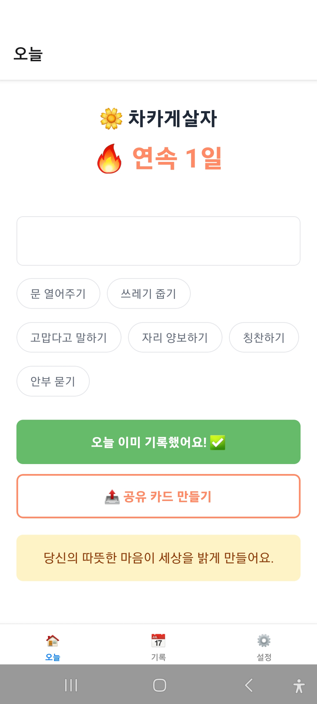
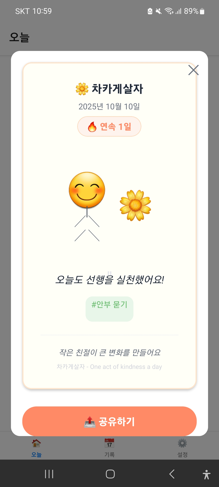

# KindnessApp - 차카게살자 (One act of kindness a day)

📅 Generated: 2025-12-04 10:43:43

## 📱 Project Overview

React Native/Expo 기반 매일 선행 기록 앱
- 10초 간단 기록 (텍스트/프리셋/사진)
- 연속일(Streak) 추적
- 따뜻한 격려 메시지
- 공유 카드 생성
- 달력 뷰 & 기록 관리
- 인앱 구매 (개발자 후원)

## 📁 Project Structure

```
├── app/
│   ├── (tabs)/
│   │   ├── _layout.tsx
│   │   ├── history.tsx
│   │   ├── index.tsx
│   │   └── settings.tsx
│   ├── modals/
│   └── _layout.tsx
├── assets/
│   └── images/
├── components/
│   ├── cards/
│   ├── share/
│   │   └── ShareCard.tsx
│   └── ui/
├── hooks/
│   └── useIAP.ts
├── lib/
│   ├── db/
│   │   └── database.ts
│   ├── i18n/
│   │   ├── locales/
│   │   │   ├── en.ts
│   │   │   └── ko.ts
│   │   └── index.ts
│   ├── presets/
│   │   └── kindness.ts
│   ├── messages.ts
│   ├── types.ts
│   └── utils.ts
├── screenshots/
├── store_assets/
│   └── app_description.txt
├── stores/
│   ├── kindnessStore.ts
│   └── settingsStore.ts
├── app.json
├── babel.config.js
├── eas.json
├── index.ts
├── kindness_app_snapshot_20251203_200838.md
├── metro.config.js
├── package.json
├── README.md
└── tsconfig.json

```

## 📄 Core Files

### 📌 package.json

- Size: 1,406 bytes
- Modified: 2025-12-04 10:21:33

```json
{
  "name": "kindness-app",
  "version": "1.0.0",
  "private": true,
  "main": "index.ts",
  "scripts": {
    "start": "expo start",
    "android": "expo start --android",
    "ios": "expo start --ios",
    "web": "expo start --web",
    "clear": "expo start -c",
    "prebuild": "expo prebuild",
    "build:android": "eas build --platform android",
    "build:ios": "eas build --platform ios",
    "lint": "tsc --noEmit",
    "create-icons": "node create_temp_icon.js"
  },
  "dependencies": {
    "@react-native-async-storage/async-storage": "^2.1.0",
    "expo": "54",
    "expo-constants": "~18.0.0",
    "expo-dev-client": "~6.0.0",
    "expo-doctor": "^1.17.11",
    "expo-file-system": "~19.0.0",
    "expo-haptics": "^15.0.0",
    "expo-iap": "^3.1.8",
    "expo-image-manipulator": "~14.0.0",
    "expo-image-picker": "~17.0.0",
    "expo-linking": "~8.0.0",
    "expo-router": "~6.0.0",
    "expo-sharing": "~14.0.0",
    "expo-sqlite": "^16.0.0",
    "expo-status-bar": "~3.0.0",
    "react": "19.1.0",
    "react-dom": "19.1.0",
    "react-native": "0.81.5",
    "react-native-safe-area-context": "^5.6.0",
    "react-native-screens": "~4.16.0",
    "react-native-svg": "15.12.1",
    "react-native-view-shot": "^4.0.3",
    "scheduler": "0.27.0",
    "zustand": "^5.0.8"
  },
  "devDependencies": {
    "@babel/core": "^7.26.0",
    "@types/react": "~19.1.0",
    "typescript": "~5.9.0"
  }
}

```

### 📌 app.json

- Size: 1,190 bytes
- Modified: 2025-12-04 10:21:20

```json
{
  "expo": {
    "name": "차카게살자",
    "slug": "kindness-app",
    "version": "1.0.0",
    "orientation": "portrait",
    "icon": "./assets/images/icon.png",
    "userInterfaceStyle": "light",
    "scheme": "kindnessapp",
    "splash": {
      "image": "./assets/images/splash.png",
      "resizeMode": "contain",
      "backgroundColor": "#FFFFFF"
    },
    "ios": {
      "supportsTablet": true,
      "bundleIdentifier": "io.thisandthatstud.kindnessapp",
      "buildNumber": "1"
    },
    "android": {
      "package": "io.thisandthatstud.kindnessapp",
      "versionCode": 1,
      "adaptiveIcon": {
        "foregroundImage": "./assets/images/adaptive-icon.png",
        "backgroundColor": "#FFFFFF"
      }
    },
    "web": {
      "favicon": "./assets/images/favicon.png",
      "bundler": "metro",
      "output": "static"
    },
    "plugins": [
      "expo-router",
      [
        "expo-iap",
        {
          "android": {
            "isGooglePlayAvailable": true
          }
        }
      ]
    ],
    "extra": {
      "router": {
        "origin": false
      },
      "eas": {
        "projectId": "5fedc720-135e-430a-9c3d-b592d4d91260"
      }
    }
  }
}
```

### 📌 babel.config.js

- Size: 111 bytes
- Modified: 2025-10-04 17:50:59

```javascript
module.exports = function(api) {
  api.cache(true);
  return {
    presets: ['babel-preset-expo'],
  };
};
```

### 📌 index.ts

- Size: 27 bytes
- Modified: 2025-10-04 17:54:51

```typescript
import 'expo-router/entry';
```

### 📌 tsconfig.json

- Size: 187 bytes
- Modified: 2025-12-04 09:52:07

```json
{
  "compilerOptions": {
    "jsx": "react-native",
    "strict": false,
    "esModuleInterop": true,
    "skipLibCheck": true,
    "noEmit": true
  },
  "extends": "expo/tsconfig.base"
}
```

### 📌 metro.config.js

- Size: 338 bytes
- Modified: 2025-12-04 09:52:53

```javascript
const { getDefaultConfig } = require('expo/metro-config');

const config = getDefaultConfig(__dirname);

// 한글 경로 관련 설정
config.resolver.sourceExts = [...config.resolver.sourceExts];
config.transformer.minifierConfig = {
  keep_fnames: true,
  mangle: {
    keep_fnames: true,
  },
};

module.exports = config;
```

### 📌 eas.json

- Size: 344 bytes
- Modified: 2025-10-04 21:15:51

```json
{
  "cli": {
    "version": ">= 16.20.1",
    "appVersionSource": "remote"
  },
  "build": {
    "development": {
      "developmentClient": true,
      "distribution": "internal"
    },
    "preview": {
      "distribution": "internal"
    },
    "production": {
      "autoIncrement": true
    }
  },
  "submit": {
    "production": {}
  }
}

```

### 📌 app/_layout.tsx

- Size: 324 bytes
- Modified: 2025-12-04 09:55:44

```typescriptreact
import { Stack } from 'expo-router';
import { useEffect } from 'react';
import i18n from '../lib/i18n';

export default function RootLayout() {
  useEffect(() => {
    i18n.loadLocale();
  }, []);

  return (
    <Stack>
      <Stack.Screen name="(tabs)" options={{ headerShown: false }} />
    </Stack>
  );
}
```

### 📌 app/(tabs)/_layout.tsx

- Size: 1,953 bytes
- Modified: 2025-12-04 09:57:12

```typescriptreact
import { Tabs } from 'expo-router';
import { Image, StyleSheet } from 'react-native';
import { useEffect, useState } from 'react';
import i18n, { t } from '../../lib/i18n';

export default function TabLayout() {
  const [, forceUpdate] = useState({});

  useEffect(() => {
    const unsubscribe = i18n.subscribe(() => forceUpdate({}));
    i18n.loadLocale();
    return unsubscribe;
  }, []);

  return (
    <Tabs
      screenOptions={{
        tabBarActiveTintColor: '#FF8A65',
        tabBarInactiveTintColor: '#9CA3AF',
      }}
    >
      <Tabs.Screen
        name="index"
        options={{
          title: t('tabs.today'),
          tabBarIcon: ({ focused }) => (
            <Image
              source={require('../../assets/images/house.png')}
              style={[
                styles.icon,
                { tintColor: focused ? '#FF8A65' : '#9CA3AF' }
              ]}
            />
          ),
        }}
      />
      <Tabs.Screen
        name="history"
        options={{
          title: t('tabs.history'),
          tabBarIcon: ({ focused }) => (
            <Image
              source={require('../../assets/images/calendar.png')}
              style={[
                styles.icon,
                { tintColor: focused ? '#FF8A65' : '#9CA3AF' }
              ]}
            />
          ),
        }}
      />
      <Tabs.Screen
        name="settings"
        options={{
          title: t('tabs.settings'),
          tabBarIcon: ({ focused }) => (
            <Image
              source={require('../../assets/images/settings.png')}
              style={[
                styles.icon,
                { tintColor: focused ? '#FF8A65' : '#9CA3AF' }
              ]}
            />
          ),
        }}
      />
    </Tabs>
  );
}

const styles = StyleSheet.create({
  icon: {
    width: 24,
    height: 24,
    resizeMode: 'contain',
  },
});
```

### 📌 app/(tabs)/index.tsx

- Size: 11,890 bytes
- Modified: 2025-12-04 09:56:12

```typescriptreact
import React, { useState, useEffect, useRef } from 'react';
import {
  View,
  Text,
  TextInput,
  TouchableOpacity,
  StyleSheet,
  ScrollView,
  Alert,
  Animated,
  Modal,
  Image,
} from 'react-native';
import useKindnessStore from '../../stores/kindnessStore';
import useSettingsStore from '../../stores/settingsStore';
import { PRESET_ACTS } from '../../lib/presets/kindness';
import { initDatabase } from '../../lib/db/database';
import { getRandomMessage, getStreakMessage } from '../../lib/messages';
import { getToday } from '../../lib/utils';
import ShareCard from '../../components/share/ShareCard';
import i18n, { t } from '../../lib/i18n';

export default function TodayScreen() {
  const [text, setText] = useState('');
  const [selectedPresets, setSelectedPresets] = useState<string[]>([]);
  const [showMessage, setShowMessage] = useState(false);
  const [encouragementMessage, setEncouragementMessage] = useState('');
  const [showShareModal, setShowShareModal] = useState(false);
  const [lastKindness, setLastKindness] = useState<any>(null);
  const [, forceUpdate] = useState({});
  
  const fadeAnim = useRef(new Animated.Value(0)).current;
  const scaleAnim = useRef(new Animated.Value(0.8)).current;
  
  const { streak, byDate, todayKindness, addKindness, loadKindnesses } = useKindnessStore();
  const { customPresets, hiddenPresetIds, loadSettings } = useSettingsStore();

  useEffect(() => {
    const unsubscribe = i18n.subscribe(() => forceUpdate({}));
    initDatabase().then(() => {
      loadKindnesses();
      loadSettings();
      i18n.loadLocale();
    });
    return unsubscribe;
  }, []);

  // 보여질 프리셋 계산
  const allPresets = [...PRESET_ACTS, ...customPresets];
  const visiblePresets = allPresets.filter(
    preset => !hiddenPresetIds.includes(preset.id)
  );

  // 프리셋 라벨 가져오기 (i18n 지원)
  const getPresetLabel = (preset: { id: string; label: string }) => {
    const localeKey = `presets.${preset.id}`;
    const translated = t(localeKey);
    return translated !== localeKey ? translated : preset.label;
  };

  const togglePreset = (id: string) => {
    Animated.sequence([
      Animated.timing(scaleAnim, {
        toValue: 0.95,
        duration: 100,
        useNativeDriver: true,
      }),
      Animated.timing(scaleAnim, {
        toValue: 1,
        duration: 100,
        useNativeDriver: true,
      }),
    ]).start();

    setSelectedPresets(prev =>
      prev.includes(id) 
        ? prev.filter(p => p !== id)
        : [...prev, id]
    );
  };

  const showEncouragement = (message: string) => {
    setEncouragementMessage(message);
    setShowMessage(true);
    
    Animated.parallel([
      Animated.timing(fadeAnim, {
        toValue: 1,
        duration: 300,
        useNativeDriver: true,
      }),
      Animated.spring(scaleAnim, {
        toValue: 1,
        friction: 8,
        tension: 40,
        useNativeDriver: true,
      }),
    ]).start();

    setTimeout(() => {
      Animated.timing(fadeAnim, {
        toValue: 0,
        duration: 300,
        useNativeDriver: true,
      }).start(() => setShowMessage(false));
    }, 3000);
  };

  const handleRecord = async () => {
    if (!text && selectedPresets.length === 0) {
      Alert.alert(t('today.alert'), t('today.pleaseEnter'));
      return;
    }

    const today = getToday();
    const newKindness = {
      date: today,
      text: text || undefined,
      presetIds: selectedPresets.length > 0 ? selectedPresets : undefined,
    };
    
    await addKindness(newKindness);
    
    setLastKindness({
      ...newKindness,
      presets: selectedPresets.map(id => {
        const preset = allPresets.find(p => p.id === id);
        return preset ? getPresetLabel(preset) : id;
      }),
    });

    // 연속일 메시지 체크
    const streakMessage = getStreakMessage(streak + 1);
    const message = streakMessage || getRandomMessage();
    showEncouragement(message);

    setText('');
    setSelectedPresets([]);
  };

  const openShareModal = () => {
    if (!lastKindness && !todayKindness) {
      Alert.alert(t('today.alert'), t('today.recordFirst'));
      return;
    }
    setShowShareModal(true);
  };

  const todayData = byDate[getToday()]?.[0];
  const shareData = lastKindness || (todayData && {
    text: todayData.text || t('share.practiced'),
    presets: todayData.presetIds?.map(id => {
      const preset = allPresets.find(p => p.id === id);
      return preset ? getPresetLabel(preset) : id;
    }) || [],
  });

  return (
    <>
      <ScrollView style={styles.container}>
        <View style={styles.header}>
          <View style={styles.titleRow}>
            <Image
              source={require('../../assets/images/flower.png')}
              style={styles.titleIcon}
            />
            <Text style={styles.title}>{t('today.title')}</Text>
          </View>
          <Animated.View style={[styles.streakRow, { transform: [{ scale: scaleAnim }] }]}>
            <Image
              source={require('../../assets/images/fire.png')}
              style={styles.streakIcon}
            />
            <Text style={styles.streak}>
              {t('today.streak')} {streak}{t('today.days')}
            </Text>
          </Animated.View>
        </View>

        <View style={styles.inputSection}>
          <TextInput
            style={styles.input}
            placeholder={t('today.inputPlaceholder')}
            value={text}
            onChangeText={setText}
            multiline
            editable={!todayKindness}
          />

          <View style={styles.presets}>
            {visiblePresets.map(preset => (
              <TouchableOpacity
                key={preset.id}
                style={[
                  styles.chip,
                  selectedPresets.includes(preset.id) && styles.chipSelected
                ]}
                onPress={() => togglePreset(preset.id)}
                disabled={!!todayKindness}
              >
                <Text style={[
                  styles.chipText,
                  selectedPresets.includes(preset.id) && styles.chipTextSelected
                ]}>
                  {getPresetLabel(preset)}
                </Text>
              </TouchableOpacity>
            ))}
          </View>

          <TouchableOpacity 
            style={[styles.button, todayKindness && styles.buttonDisabled]}
            onPress={handleRecord}
            disabled={!!todayKindness}
          >
            {todayKindness ? (
              <View style={styles.buttonContent}>
                <Image
                  source={require('../../assets/images/check.png')}
                  style={styles.buttonIcon}
                />
                <Text style={styles.buttonText}>{t('today.alreadyRecorded')}</Text>
              </View>
            ) : (
              <Text style={styles.buttonText}>{t('today.record')}</Text>
            )}
          </TouchableOpacity>

          {(lastKindness || todayKindness) && (
            <TouchableOpacity 
              style={styles.shareButton}
              onPress={openShareModal}
            >
              <Image
                source={require('../../assets/images/share.png')}
                style={styles.shareButtonIcon}
              />
              <Text style={styles.shareButtonText}>{t('today.shareCard')}</Text>
            </TouchableOpacity>
          )}

          {showMessage && (
            <Animated.View 
              style={[
                styles.message,
                {
                  opacity: fadeAnim,
                  transform: [{ scale: scaleAnim }],
                },
              ]}
            >
              <Text style={styles.messageText}>
                {encouragementMessage}
              </Text>
            </Animated.View>
          )}
        </View>
      </ScrollView>

      {/* 공유 모달 */}
      <Modal
        visible={showShareModal}
        animationType="slide"
        transparent={true}
        onRequestClose={() => setShowShareModal(false)}
      >
        <View style={styles.modalOverlay}>
          <View style={styles.modalContent}>
            <TouchableOpacity 
              style={styles.closeButton}
              onPress={() => setShowShareModal(false)}
            >
              <Text style={styles.closeText}>✕</Text>
            </TouchableOpacity>
            
            {shareData && (
              <ShareCard
                date={getToday()}
                text={shareData.text || t('share.practiced')}
                streak={streak}
                presets={shareData.presets}
              />
            )}
          </View>
        </View>
      </Modal>
    </>
  );
}

const styles = StyleSheet.create({
  container: {
    flex: 1,
    backgroundColor: '#FFFFFF',
  },
  header: {
    alignItems: 'center',
    paddingVertical: 30,
  },
  titleRow: {
    flexDirection: 'row',
    alignItems: 'center',
  },
  titleIcon: {
    width: 28,
    height: 28,
    marginRight: 8,
  },
  title: {
    fontSize: 24,
    fontWeight: 'bold',
    color: '#1F2937',
  },
  streakRow: {
    flexDirection: 'row',
    alignItems: 'center',
    marginTop: 10,
  },
  streakIcon: {
    width: 32,
    height: 32,
    marginRight: 8,
  },
  streak: {
    fontSize: 32,
    fontWeight: 'bold',
    color: '#FF8A65',
  },
  inputSection: {
    padding: 20,
  },
  input: {
    borderWidth: 1,
    borderColor: '#E5E7EB',
    borderRadius: 8,
    padding: 12,
    fontSize: 16,
    minHeight: 60,
  },
  presets: {
    flexDirection: 'row',
    flexWrap: 'wrap',
    marginTop: 15,
    gap: 8,
  },
  chip: {
    paddingHorizontal: 16,
    paddingVertical: 8,
    borderRadius: 20,
    borderWidth: 1,
    borderColor: '#E5E7EB',
    marginBottom: 8,
  },
  chipSelected: {
    backgroundColor: '#FF8A65',
    borderColor: '#FF8A65',
  },
  chipText: {
    color: '#6B7280',
  },
  chipTextSelected: {
    color: '#FFFFFF',
  },
  button: {
    backgroundColor: '#FF8A65',
    padding: 16,
    borderRadius: 8,
    alignItems: 'center',
    marginTop: 20,
  },
  buttonDisabled: {
    backgroundColor: '#66BB6A',
  },
  buttonContent: {
    flexDirection: 'row',
    alignItems: 'center',
  },
  buttonIcon: {
    width: 20,
    height: 20,
    marginRight: 8,
    tintColor: '#FFFFFF',
  },
  buttonText: {
    color: '#FFFFFF',
    fontSize: 16,
    fontWeight: 'bold',
  },
  shareButton: {
    backgroundColor: '#FFFFFF',
    borderWidth: 2,
    borderColor: '#FF8A65',
    padding: 14,
    borderRadius: 8,
    alignItems: 'center',
    marginTop: 12,
    flexDirection: 'row',
    justifyContent: 'center',
  },
  shareButtonIcon: {
    width: 20,
    height: 20,
    marginRight: 8,
    tintColor: '#FF8A65',
  },
  shareButtonText: {
    color: '#FF8A65',
    fontSize: 16,
    fontWeight: 'bold',
  },
  message: {
    marginTop: 20,
    padding: 16,
    backgroundColor: '#FEF3C7',
    borderRadius: 8,
  },
  messageText: {
    textAlign: 'center',
    color: '#92400E',
    fontSize: 16,
    lineHeight: 24,
  },
  modalOverlay: {
    flex: 1,
    backgroundColor: 'rgba(0, 0, 0, 0.5)',
    justifyContent: 'center',
    alignItems: 'center',
  },
  modalContent: {
    backgroundColor: '#FFFFFF',
    borderRadius: 16,
    width: '90%',
    maxHeight: '80%',
  },
  closeButton: {
    position: 'absolute',
    right: 15,
    top: 15,
    zIndex: 1,
  },
  closeText: {
    fontSize: 24,
    color: '#6B7280',
  },
});
```

### 📌 app/(tabs)/history.tsx

- Size: 8,431 bytes
- Modified: 2025-12-04 09:56:54

```typescriptreact
import React, { useEffect, useState } from 'react';
import {
  View,
  Text,
  StyleSheet,
  ScrollView,
  TouchableOpacity,
  Image,
} from 'react-native';
import useKindnessStore from '../../stores/kindnessStore';
import { formatDate, getToday } from '../../lib/utils';
import { PRESET_ACTS } from '../../lib/presets/kindness';
import i18n, { t } from '../../lib/i18n';

export default function HistoryScreen() {
  const { byDate, loadKindnesses, removeKindness } = useKindnessStore();
  const [selectedDate, setSelectedDate] = useState<string | null>(null);
  const [currentMonth, setCurrentMonth] = useState(new Date());
  const [, forceUpdate] = useState({});

  useEffect(() => {
    const unsubscribe = i18n.subscribe(() => forceUpdate({}));
    loadKindnesses();
    i18n.loadLocale();
    return unsubscribe;
  }, []);

  // 달력 데이터 생성
  const generateCalendarDays = () => {
    const year = currentMonth.getFullYear();
    const month = currentMonth.getMonth();
    const firstDay = new Date(year, month, 1);
    const lastDay = new Date(year, month + 1, 0);
    const startDate = firstDay.getDay();
    
    const days = [];
    
    // 빈 날짜 채우기
    for (let i = 0; i < startDate; i++) {
      days.push(null);
    }
    
    // 실제 날짜 채우기
    for (let i = 1; i <= lastDay.getDate(); i++) {
      const dateStr = formatDate(new Date(year, month, i));
      days.push({
        day: i,
        date: dateStr,
        hasKindness: !!byDate[dateStr]?.length,
      });
    }
    
    return days;
  };

  const calendarDays = generateCalendarDays();
  const selectedKindnesses = selectedDate ? byDate[selectedDate] || [] : [];

  const handlePrevMonth = () => {
    setCurrentMonth(new Date(currentMonth.getFullYear(), currentMonth.getMonth() - 1));
  };

  const handleNextMonth = () => {
    setCurrentMonth(new Date(currentMonth.getFullYear(), currentMonth.getMonth() + 1));
  };

  const handleDeleteKindness = async (date: string, id: string) => {
    await removeKindness(date, id);
    if (byDate[date]?.length === 0) {
      setSelectedDate(null);
    }
  };

  const getPresetLabel = (id: string) => {
    const localeKey = `presets.${id}`;
    const translated = t(localeKey);
    if (translated !== localeKey) return translated;
    return PRESET_ACTS.find(p => p.id === id)?.label || id;
  };

  const formatMonthTitle = () => {
    const year = currentMonth.getFullYear();
    const month = currentMonth.getMonth() + 1;
    const locale = i18n.getLocale();
    
    if (locale === 'ko') {
      return `${year}년 ${month}월`;
    } else {
      const monthNames = ['January', 'February', 'March', 'April', 'May', 'June',
        'July', 'August', 'September', 'October', 'November', 'December'];
      return `${monthNames[month - 1]} ${year}`;
    }
  };

  const weekDays = t('history.weekDays') as unknown as string[];

  return (
    <ScrollView style={styles.container}>
      {/* 월 네비게이션 */}
      <View style={styles.monthHeader}>
        <TouchableOpacity onPress={handlePrevMonth}>
          <Text style={styles.monthNav}>{'<'}</Text>
        </TouchableOpacity>
        <Text style={styles.monthTitle}>{formatMonthTitle()}</Text>
        <TouchableOpacity onPress={handleNextMonth}>
          <Text style={styles.monthNav}>{'>'}</Text>
        </TouchableOpacity>
      </View>

      {/* 요일 헤더 */}
      <View style={styles.weekHeader}>
        {weekDays.map((day, index) => (
          <Text key={index} style={styles.weekDay}>{day}</Text>
        ))}
      </View>

      {/* 달력 그리드 */}
      <View style={styles.calendar}>
        {calendarDays.map((day, index) => (
          <TouchableOpacity
            key={index}
            style={[
              styles.calendarDay,
              day?.hasKindness && styles.hasKindness,
              day?.date === selectedDate && styles.selectedDay,
              day?.date === getToday() && styles.today,
            ]}
            onPress={() => day?.hasKindness && setSelectedDate(day.date)}
            disabled={!day || !day.hasKindness}
          >
            {day && (
              <View style={styles.dayContent}>
                <Text style={[
                  styles.dayNumber,
                  day.hasKindness && styles.hasKindnessText,
                  day.date === selectedDate && styles.selectedDayText,
                ]}>
                  {day.day}
                </Text>
                {day.hasKindness && (
                  <Image
                    source={require('../../assets/images/flower.png')}
                    style={styles.kindnessIcon}
                  />
                )}
              </View>
            )}
          </TouchableOpacity>
        ))}
      </View>

      {/* 선택한 날짜의 기록 */}
      {selectedDate && selectedKindnesses.length > 0 && (
        <View style={styles.kindnessList}>
          <Text style={styles.listTitle}>{selectedDate}{t('history.recordOf')}</Text>
          {selectedKindnesses.map(kindness => (
            <View key={kindness.id} style={styles.kindnessItem}>
              {kindness.text && (
                <Text style={styles.kindnessText}>{kindness.text}</Text>
              )}
              {kindness.presetIds && kindness.presetIds.length > 0 && (
                <View style={styles.presetTags}>
                  {kindness.presetIds.map(id => (
                    <Text key={id} style={styles.presetTag}>
                      {getPresetLabel(id)}
                    </Text>
                  ))}
                </View>
              )}
              <TouchableOpacity
                style={styles.deleteButton}
                onPress={() => handleDeleteKindness(selectedDate, kindness.id)}
              >
                <Text style={styles.deleteText}>{t('history.delete')}</Text>
              </TouchableOpacity>
            </View>
          ))}
        </View>
      )}
    </ScrollView>
  );
}

const styles = StyleSheet.create({
  container: {
    flex: 1,
    backgroundColor: '#FFFFFF',
  },
  monthHeader: {
    flexDirection: 'row',
    justifyContent: 'space-between',
    alignItems: 'center',
    padding: 20,
  },
  monthNav: {
    fontSize: 24,
    color: '#FF8A65',
    padding: 10,
  },
  monthTitle: {
    fontSize: 20,
    fontWeight: 'bold',
    color: '#1F2937',
  },
  weekHeader: {
    flexDirection: 'row',
    paddingHorizontal: 20,
    paddingBottom: 10,
  },
  weekDay: {
    flex: 1,
    textAlign: 'center',
    color: '#6B7280',
    fontSize: 14,
  },
  calendar: {
    flexDirection: 'row',
    flexWrap: 'wrap',
    paddingHorizontal: 20,
  },
  calendarDay: {
    width: '14.28%',
    aspectRatio: 1,
    justifyContent: 'center',
    alignItems: 'center',
    borderWidth: 1,
    borderColor: '#E5E7EB',
  },
  dayContent: {
    alignItems: 'center',
    justifyContent: 'center',
  },
  dayNumber: {
    fontSize: 16,
    color: '#1F2937',
  },
  hasKindness: {
    backgroundColor: '#FEF3C7',
  },
  hasKindnessText: {
    fontWeight: 'bold',
  },
  kindnessIcon: {
    width: 12,
    height: 12,
    marginTop: 2,
    resizeMode: 'contain',
  },
  selectedDay: {
    backgroundColor: '#FF8A65',
  },
  selectedDayText: {
    color: '#FFFFFF',
  },
  today: {
    borderColor: '#FF8A65',
    borderWidth: 2,
  },
  kindnessList: {
    padding: 20,
    marginTop: 20,
    borderTopWidth: 1,
    borderTopColor: '#E5E7EB',
  },
  listTitle: {
    fontSize: 18,
    fontWeight: 'bold',
    marginBottom: 15,
    color: '#1F2937',
  },
  kindnessItem: {
    backgroundColor: '#F9FAFB',
    padding: 15,
    borderRadius: 8,
    marginBottom: 10,
  },
  kindnessText: {
    fontSize: 16,
    color: '#1F2937',
    marginBottom: 8,
  },
  presetTags: {
    flexDirection: 'row',
    flexWrap: 'wrap',
    gap: 5,
    marginBottom: 8,
  },
  presetTag: {
    backgroundColor: '#66BB6A',
    color: '#FFFFFF',
    paddingHorizontal: 8,
    paddingVertical: 4,
    borderRadius: 12,
    fontSize: 12,
    overflow: 'hidden',
  },
  deleteButton: {
    alignSelf: 'flex-end',
  },
  deleteText: {
    color: '#EF4444',
    fontSize: 14,
  },
});
```

### 📌 app/(tabs)/settings.tsx

- Size: 17,043 bytes
- Modified: 2025-12-04 09:56:36

```typescriptreact
import React, { useEffect, useState } from 'react';
import {
  View,
  Text,
  StyleSheet,
  ScrollView,
  TouchableOpacity,
  Switch,
  Alert,
  TextInput,
  Linking,
  Modal,
} from 'react-native';
import useSettingsStore from '../../stores/settingsStore';
import useIAP, { PRODUCT_DETAILS, IAP_PRODUCTS } from '../../hooks/useIAP';
import { PRESET_ACTS } from '../../lib/presets/kindness';
import i18n, { t, Locale } from '../../lib/i18n';

export default function SettingsScreen() {
  const [showPresetModal, setShowPresetModal] = useState(false);
  const [showLanguageModal, setShowLanguageModal] = useState(false);
  const [newPresetText, setNewPresetText] = useState('');
  const [, forceUpdate] = useState({});

  const {
    customPresets,
    hiddenPresetIds,
    notificationEnabled,
    isDonor,
    loadSettings,
    addCustomPreset,
    removeCustomPreset,
    togglePresetVisibility,
    setNotificationEnabled,
    setDonor,
  } = useSettingsStore();

  const {
    isConnected,
    isIAPAvailable,
    isPurchasing,
    products,
    productsById,
    purchaseHistory,
    purchaseProduct,
    restorePurchases,
  } = useIAP();

  useEffect(() => {
    const unsubscribe = i18n.subscribe(() => forceUpdate({}));
    loadSettings();
    i18n.loadLocale();
    return unsubscribe;
  }, []);

  useEffect(() => {
    if (purchaseHistory.length > 0 && !isDonor) setDonor(true);
  }, [purchaseHistory]);

  const handleAddPreset = () => {
    if (newPresetText.trim()) {
      addCustomPreset(newPresetText.trim());
      setNewPresetText('');
      setShowPresetModal(false);
    }
  };

  const handleDeletePreset = (id: string) => {
    Alert.alert(t('settings.deletePreset'), t('settings.deletePresetConfirm'), [
      { text: t('settings.cancel'), style: 'cancel' },
      { text: t('settings.delete'), onPress: () => removeCustomPreset(id), style: 'destructive' },
    ]);
  };

  const handleLanguageChange = async (locale: Locale) => {
    await i18n.setLocale(locale);
    setShowLanguageModal(false);
  };

  const getPresetLabel = (preset: { id: string; label: string }) => {
    const localeKey = `presets.${preset.id}`;
    const translated = t(localeKey);
    return translated !== localeKey ? translated : preset.label;
  };

  const allPresets = [...PRESET_ACTS, ...customPresets];

  const getDisplayPrice = (productId: string) => {
    const p = productsById[productId];
    const details = PRODUCT_DETAILS[productId];
    return p?.displayPrice || details?.fallbackPrice || '';
  };

  const currentLocale = i18n.getLocale();

  return (
    <>
      <ScrollView style={styles.container}>
        <View style={styles.header}>
          <Text style={styles.title}>⚙️ {t('settings.title')}</Text>
          <View style={styles.storeStatus}>
            <Text style={[styles.storeDot, { backgroundColor: isConnected ? '#22C55E' : '#F59E0B' }]} />
            <Text style={styles.storeStatusText}>
              {isConnected ? t('settings.storeConnected') : t('settings.storeConnecting')}
            </Text>
          </View>
          {isDonor && (
            <View style={styles.donorBadge}>
              <Text style={styles.donorText}>{t('settings.donor')}</Text>
            </View>
          )}
        </View>

        {/* 프리셋 관리 */}
        <View style={styles.section}>
          <Text style={styles.sectionTitle}>{t('settings.presetManagement')}</Text>

          {allPresets.map((preset) => (
            <View key={preset.id} style={styles.presetItem}>
              <Text
                style={[
                  styles.presetLabel,
                  hiddenPresetIds.includes(preset.id) && styles.hiddenPreset,
                ]}
              >
                {getPresetLabel(preset)}
              </Text>

              <View style={styles.presetActions}>
                <TouchableOpacity onPress={() => togglePresetVisibility(preset.id)}>
                  <Text style={styles.actionButton}>
                    {hiddenPresetIds.includes(preset.id) ? '❌' : '✅'}
                  </Text>
                </TouchableOpacity>

                {preset.id.startsWith('custom_') && (
                  <TouchableOpacity onPress={() => handleDeletePreset(preset.id)}>
                    <Text style={styles.deleteButton}>{t('settings.delete')}</Text>
                  </TouchableOpacity>
                )}
              </View>
            </View>
          ))}

          <TouchableOpacity style={styles.addButton} onPress={() => setShowPresetModal(true)}>
            <Text style={styles.addButtonText}>{t('settings.addPreset')}</Text>
          </TouchableOpacity>
        </View>

        {/* 알림 설정 */}
        <View style={styles.section}>
          <Text style={styles.sectionTitle}>{t('settings.notification')}</Text>
          <View style={styles.switchRow}>
            <Text style={styles.switchLabel}>{t('settings.dailyNotification')}</Text>
            <Switch
              value={notificationEnabled}
              onValueChange={setNotificationEnabled}
              trackColor={{ false: '#E5E7EB', true: '#FF8A65' }}
              thumbColor={notificationEnabled ? '#FFFFFF' : '#F3F4F6'}
            />
          </View>
        </View>

        {/* 언어 설정 */}
        <View style={styles.section}>
          <Text style={styles.sectionTitle}>{t('settings.language')}</Text>
          <TouchableOpacity 
            style={styles.languageButton}
            onPress={() => setShowLanguageModal(true)}
          >
            <Text style={styles.languageLabel}>{t('settings.selectLanguage')}</Text>
            <Text style={styles.languageValue}>
              {currentLocale === 'ko' ? '한국어' : 'English'} ›
            </Text>
          </TouchableOpacity>
        </View>

        {/* 개발자 후원 (IAP) */}
        <View style={styles.section}>
          <Text style={styles.sectionTitle}>{t('settings.supportDeveloper')}</Text>
          <Text style={styles.supportText}>{t('settings.supportText')}</Text>

          {!isIAPAvailable && (
            <Text style={styles.iapWarning}>{t('settings.purchaseNotAvailable')}</Text>
          )}

          {/* 커피 1,900원 */}
          <TouchableOpacity
            style={[styles.iapItem, !isIAPAvailable && styles.iapItemDisabled]}
            onPress={() => purchaseProduct(IAP_PRODUCTS.COFFEE)}
            disabled={isPurchasing || !isIAPAvailable}
          >
            <View>
              <Text style={styles.iapTitle}>{t('settings.coffeeTitle')}</Text>
              <Text style={styles.iapDesc}>{t('settings.coffeeDesc')}</Text>
            </View>
            <Text style={styles.iapPrice}>{getDisplayPrice(IAP_PRODUCTS.COFFEE)}</Text>
          </TouchableOpacity>

          {/* 밥 6,900원 */}
          <TouchableOpacity
            style={[styles.iapItem, !isIAPAvailable && styles.iapItemDisabled]}
            onPress={() => purchaseProduct(IAP_PRODUCTS.MEAL)}
            disabled={isPurchasing || !isIAPAvailable}
          >
            <View>
              <Text style={styles.iapTitle}>{t('settings.mealTitle')}</Text>
              <Text style={styles.iapDesc}>{t('settings.mealDesc')}</Text>
            </View>
            <Text style={styles.iapPrice}>{getDisplayPrice(IAP_PRODUCTS.MEAL)}</Text>
          </TouchableOpacity>

          <TouchableOpacity 
            style={[styles.restoreButton, !isIAPAvailable && styles.restoreButtonDisabled]} 
            onPress={restorePurchases}
            disabled={!isIAPAvailable}
          >
            <Text style={styles.restoreText}>{t('settings.restorePurchases')}</Text>
          </TouchableOpacity>
        </View>

        {/* 앱 정보 */}
        <View style={styles.section}>
          <Text style={styles.sectionTitle}>{t('settings.appInfo')}</Text>
          <TouchableOpacity
            style={styles.infoRow}
            onPress={() => Linking.openURL('https://thisandthatstud.io/privacy')}
          >
            <Text style={styles.infoLabel}>{t('settings.privacyPolicy')}</Text>
            <Text style={styles.arrow}>›</Text>
          </TouchableOpacity>

          <TouchableOpacity
            style={styles.infoRow}
            onPress={() => Linking.openURL('https://thisandthatstud.io/terms')}
          >
            <Text style={styles.infoLabel}>{t('settings.terms')}</Text>
            <Text style={styles.arrow}>›</Text>
          </TouchableOpacity>

          <View style={styles.infoRow}>
            <Text style={styles.infoLabel}>{t('settings.version')}</Text>
            <Text style={styles.infoValue}>1.0.0</Text>
          </View>

          <View style={styles.infoRow}>
            <Text style={styles.infoLabel}>{t('settings.contact')}</Text>
            <TouchableOpacity onPress={() => Linking.openURL('mailto:contact@thisandthatstud.io')}>
              <Text style={styles.emailLink}>contact@thisandthatstud.io</Text>
            </TouchableOpacity>
          </View>
        </View>

        <View style={{ height: 50 }} />
      </ScrollView>

      {/* 프리셋 추가 모달 */}
      <Modal
        visible={showPresetModal}
        animationType="slide"
        transparent={true}
        onRequestClose={() => setShowPresetModal(false)}
      >
        <View style={styles.modalOverlay}>
          <View style={styles.modalContent}>
            <Text style={styles.modalTitle}>{t('settings.newPreset')}</Text>

            <TextInput
              style={styles.modalInput}
              placeholder={t('settings.presetPlaceholder')}
              value={newPresetText}
              onChangeText={setNewPresetText}
              autoFocus
              maxLength={20}
            />

            <View style={styles.modalButtons}>
              <TouchableOpacity
                style={[styles.modalButton, styles.cancelButton]}
                onPress={() => {
                  setNewPresetText('');
                  setShowPresetModal(false);
                }}
              >
                <Text style={styles.cancelButtonText}>{t('settings.cancel')}</Text>
              </TouchableOpacity>

              <TouchableOpacity
                style={[styles.modalButton, styles.confirmButton]}
                onPress={handleAddPreset}
              >
                <Text style={styles.confirmButtonText}>{t('settings.add')}</Text>
              </TouchableOpacity>
            </View>
          </View>
        </View>
      </Modal>

      {/* 언어 선택 모달 */}
      <Modal
        visible={showLanguageModal}
        animationType="slide"
        transparent={true}
        onRequestClose={() => setShowLanguageModal(false)}
      >
        <View style={styles.modalOverlay}>
          <View style={styles.modalContent}>
            <Text style={styles.modalTitle}>{t('settings.selectLanguage')}</Text>

            {i18n.getAvailableLocales().map((locale) => (
              <TouchableOpacity
                key={locale.code}
                style={[
                  styles.languageOption,
                  currentLocale === locale.code && styles.languageOptionSelected,
                ]}
                onPress={() => handleLanguageChange(locale.code)}
              >
                <Text style={[
                  styles.languageOptionText,
                  currentLocale === locale.code && styles.languageOptionTextSelected,
                ]}>
                  {locale.name}
                </Text>
                {currentLocale === locale.code && (
                  <Text style={styles.checkMark}>✓</Text>
                )}
              </TouchableOpacity>
            ))}

            <TouchableOpacity
              style={[styles.modalButton, styles.cancelButton, { marginTop: 15 }]}
              onPress={() => setShowLanguageModal(false)}
            >
              <Text style={styles.cancelButtonText}>{t('settings.cancel')}</Text>
            </TouchableOpacity>
          </View>
        </View>
      </Modal>
    </>
  );
}

const styles = StyleSheet.create({
  container: { flex: 1, backgroundColor: '#FFFFFF' },
  header: {
    padding: 20,
    paddingTop: 40,
  },
  title: { fontSize: 28, fontWeight: 'bold', color: '#1F2937' },
  storeStatus: { flexDirection: 'row', alignItems: 'center', marginTop: 6, gap: 6 },
  storeDot: { width: 8, height: 8, borderRadius: 4 },
  storeStatusText: { color: '#6B7280' },
  donorBadge: {
    marginTop: 10,
    alignSelf: 'flex-start',
    backgroundColor: '#FEE2E2',
    paddingHorizontal: 12,
    paddingVertical: 6,
    borderRadius: 20,
  },
  donorText: { color: '#DC2626', fontSize: 14, fontWeight: 'bold' },
  section: { padding: 20, borderBottomWidth: 1, borderBottomColor: '#F3F4F6' },
  sectionTitle: { fontSize: 20, fontWeight: 'bold', color: '#1F2937', marginBottom: 15 },
  presetItem: {
    flexDirection: 'row',
    justifyContent: 'space-between',
    alignItems: 'center',
    paddingVertical: 12,
    borderBottomWidth: 1,
    borderBottomColor: '#F3F4F6',
  },
  presetLabel: { fontSize: 16, color: '#1F2937' },
  hiddenPreset: { color: '#9CA3AF', textDecorationLine: 'line-through' },
  presetActions: { flexDirection: 'row', gap: 15, alignItems: 'center' },
  actionButton: { fontSize: 20 },
  deleteButton: { color: '#EF4444', fontSize: 14 },
  addButton: {
    backgroundColor: '#F3F4F6',
    padding: 12,
    borderRadius: 8,
    alignItems: 'center',
    marginTop: 15,
  },
  addButtonText: { color: '#4B5563', fontSize: 16, fontWeight: '600' },
  switchRow: { flexDirection: 'row', justifyContent: 'space-between', alignItems: 'center', paddingVertical: 10 },
  switchLabel: { fontSize: 16, color: '#1F2937' },
  languageButton: {
    flexDirection: 'row',
    justifyContent: 'space-between',
    alignItems: 'center',
    paddingVertical: 12,
  },
  languageLabel: { fontSize: 16, color: '#1F2937' },
  languageValue: { fontSize: 16, color: '#6B7280' },
  supportText: { fontSize: 14, color: '#6B7280', marginBottom: 15, lineHeight: 20 },
  iapWarning: { 
    fontSize: 12, 
    color: '#F59E0B', 
    marginBottom: 10, 
    fontStyle: 'italic',
  },
  iapItem: {
    flexDirection: 'row',
    justifyContent: 'space-between',
    alignItems: 'center',
    backgroundColor: '#FEF3C7',
    padding: 15,
    borderRadius: 8,
    marginBottom: 8,
  },
  iapItemDisabled: {
    opacity: 0.5,
  },
  iapTitle: { fontSize: 16, fontWeight: '600', color: '#1F2937' },
  iapDesc: { fontSize: 12, color: '#6B7280', marginTop: 2 },
  iapPrice: { fontSize: 16, fontWeight: 'bold', color: '#FF8A65' },
  restoreButton: { marginTop: 10, alignItems: 'center' },
  restoreButtonDisabled: { opacity: 0.5 },
  restoreText: { color: '#6B7280', fontSize: 14, textDecorationLine: 'underline' },
  infoRow: {
    flexDirection: 'row',
    justifyContent: 'space-between',
    alignItems: 'center',
    paddingVertical: 12,
    borderBottomWidth: 1,
    borderBottomColor: '#F3F4F6',
  },
  infoLabel: { fontSize: 16, color: '#1F2937' },
  infoValue: { fontSize: 16, color: '#6B7280' },
  arrow: { fontSize: 20, color: '#9CA3AF' },
  emailLink: { fontSize: 14, color: '#3B82F6', textDecorationLine: 'underline' },
  modalOverlay: {
    flex: 1,
    backgroundColor: 'rgba(0, 0, 0, 0.5)',
    justifyContent: 'center',
    alignItems: 'center',
  },
  modalContent: { backgroundColor: '#FFFFFF', borderRadius: 12, padding: 20, width: '80%' },
  modalTitle: { fontSize: 20, fontWeight: 'bold', color: '#1F2937', marginBottom: 15, textAlign: 'center' },
  modalInput: {
    borderWidth: 1,
    borderColor: '#E5E7EB',
    borderRadius: 8,
    padding: 12,
    fontSize: 16,
    marginBottom: 20,
  },
  modalButtons: { flexDirection: 'row', justifyContent: 'space-between', gap: 10 },
  modalButton: { flex: 1, padding: 12, borderRadius: 8, alignItems: 'center' },
  cancelButton: { backgroundColor: '#F3F4F6' },
  cancelButtonText: { color: '#6B7280', fontSize: 16, fontWeight: '600' },
  confirmButton: { backgroundColor: '#FF8A65' },
  confirmButtonText: { color: '#FFFFFF', fontSize: 16, fontWeight: '600' },
  languageOption: {
    flexDirection: 'row',
    justifyContent: 'space-between',
    alignItems: 'center',
    paddingVertical: 15,
    paddingHorizontal: 10,
    borderBottomWidth: 1,
    borderBottomColor: '#F3F4F6',
  },
  languageOptionSelected: {
    backgroundColor: '#FEF3C7',
    borderRadius: 8,
  },
  languageOptionText: {
    fontSize: 16,
    color: '#1F2937',
  },
  languageOptionTextSelected: {
    fontWeight: 'bold',
    color: '#FF8A65',
  },
  checkMark: {
    fontSize: 18,
    color: '#FF8A65',
    fontWeight: 'bold',
  },
});
```

### 📌 lib/types.ts

- Size: 237 bytes
- Modified: 2025-12-04 09:58:12

```typescript
export type Kindness = {
  id: string;
  date: string;         // 'YYYY-MM-DD'
  text?: string;
  presetIds?: string[];
  photoUri?: string;
  createdAt: number;
};

export type PresetAct = {
  id: string;
  label: string;
};
```

### 📌 lib/db/database.ts

- Size: 475 bytes
- Modified: 2025-12-04 10:01:49

```typescript
import * as SQLite from 'expo-sqlite';

const db = SQLite.openDatabaseSync('kindness.db');

export const initDatabase = async () => {
  await db.execAsync(`
    CREATE TABLE IF NOT EXISTS kindness (
      id TEXT PRIMARY KEY,
      date TEXT NOT NULL,
      text TEXT,
      preset_ids TEXT,
      photo_uri TEXT,
      created_at INTEGER NOT NULL
    );
    
    CREATE INDEX IF NOT EXISTS idx_kindness_date ON kindness(date);
  `);
};

export default db;
```

### 📌 lib/utils.ts

- Size: 1,609 bytes
- Modified: 2025-12-04 09:58:03

```typescript
// 날짜 포맷팅
export const formatDate = (date: Date): string => {
  return date.toISOString().split('T')[0];
};

// 오늘 날짜 가져오기
export const getToday = (): string => {
  return formatDate(new Date());
};

// 날짜 문자열을 Date 객체로
export const parseDate = (dateStr: string): Date => {
  return new Date(dateStr + 'T00:00:00');
};

// 두 날짜 사이의 일수 차이
export const daysBetween = (date1: string, date2: string): number => {
  const d1 = parseDate(date1);
  const d2 = parseDate(date2);
  const diffTime = Math.abs(d2.getTime() - d1.getTime());
  return Math.floor(diffTime / (1000 * 60 * 60 * 24));
};

// 연속일 계산 (더 정확한 버전)
export const calculateStreak = (dates: string[]): number => {
  if (dates.length === 0) return 0;
  
  const sortedDates = [...dates].sort().reverse();
  const today = getToday();
  
  // 오늘 기록이 없으면 어제부터 체크
  let startDate = today;
  if (sortedDates[0] !== today) {
    const yesterday = new Date();
    yesterday.setDate(yesterday.getDate() - 1);
    startDate = formatDate(yesterday);
    
    // 어제도 기록이 없으면 streak 0
    if (sortedDates[0] !== startDate) {
      return 0;
    }
  }
  
  let streak = 0;
  let currentDate = new Date(startDate);
  
  for (const date of sortedDates) {
    const expected = formatDate(currentDate);
    if (date === expected) {
      streak++;
      currentDate.setDate(currentDate.getDate() - 1);
    } else if (date < expected) {
      break;
    }
  }
  
  return streak;
};
```

### 📌 lib/messages.ts

- Size: 2,247 bytes
- Modified: 2025-12-04 09:58:28

```typescript
import { t } from './i18n';

// 랜덤 격려 메시지 가져오기
export const getRandomMessage = (): string => {
  const messagesKey = 'messages.encouragement';
  const messages = t(messagesKey);
  
  // i18n이 배열을 반환하지 않으면 기본 메시지 사용
  if (typeof messages === 'string' && messages === messagesKey) {
    const defaultMessages = [
      '당신 덕분에 오늘이 조금 더 따뜻해졌어요.',
      '작은 친절이 큰 변화를 만들어요.',
      '당신의 선행이 누군가에게 기쁨이 되었을 거예요.',
    ];
    return defaultMessages[Math.floor(Math.random() * defaultMessages.length)];
  }
  
  // messages가 배열인 경우
  if (Array.isArray(messages)) {
    return messages[Math.floor(Math.random() * messages.length)];
  }
  
  return messages;
};

// 연속일에 따른 메시지
export const getStreakMessage = (streak: number): string | null => {
  const streakKeys: Record<number, string> = {
    3: 'messages.streak3',
    7: 'messages.streak7',
    14: 'messages.streak14',
    30: 'messages.streak30',
    100: 'messages.streak100',
  };

  const key = streakKeys[streak];
  if (!key) return null;
  
  const message = t(key);
  return message !== key ? message : null;
};

// 기본 격려 문구 (fallback용)
export const ENCOURAGEMENT_MESSAGES = [
  '당신 덕분에 오늘이 조금 더 따뜻해졌어요.',
  '작은 친절이 큰 변화를 만들어요.',
  '당신의 선행이 누군가에게 기쁨이 되었을 거예요.',
  '오늘도 멋진 하루를 만들어주셔서 감사해요.',
  '당신의 따뜻한 마음이 세상을 밝게 만들어요.',
  '한 걸음 한 걸음이 더 나은 세상을 만들어요.',
  '오늘의 작은 실천이 큰 울림이 될 거예요.',
];

// 연속일 달성 메시지 (fallback용)
export const STREAK_MESSAGES: Record<number, string> = {
  3: '🎉 3일 연속! 습관이 되어가고 있어요!',
  7: '🌟 일주일 연속! 당신은 정말 대단해요!',
  14: '💫 2주 연속! 꾸준함이 빛을 발하네요!',
  30: '🏆 한 달 연속! 당신은 진정한 천사예요!',
  100: '👑 100일 연속! 전설이 되셨습니다!',
};
```

### 📌 lib/presets/kindness.ts

- Size: 400 bytes
- Modified: 2025-12-04 10:02:04

```typescript
import { PresetAct } from '../types';

export const PRESET_ACTS: PresetAct[] = [
  { id: 'open_door',  label: '문 열어주기' },
  { id: 'pick_trash', label: '쓰레기 줍기' },
  { id: 'say_thanks', label: '고맙다고 말하기' },
  { id: 'give_seat',  label: '자리 양보하기' },
  { id: 'compliment', label: '칭찬하기' },
  { id: 'check_in',   label: '안부 묻기' },
];
```

### 📌 stores/kindnessStore.ts

- Size: 3,851 bytes
- Modified: 2025-12-04 09:57:38

```typescript
import { create } from 'zustand';
import db from '../lib/db/database';
import { Kindness } from '../lib/types';
import { calculateStreak, getToday } from '../lib/utils';

type DBKindnessRow = {
  id: string;
  date: string;
  text: string | null;
  preset_ids: string | null;
  photo_uri: string | null;
  created_at: number;
};

type KindnessState = {
  byDate: Record<string, Kindness[]>;
  streak: number;
  todayKindness: Kindness | null;
  
  loadKindnesses: () => Promise<void>;
  addKindness: (kindness: Omit<Kindness, 'id' | 'createdAt'>) => Promise<void>;
  removeKindness: (date: string, id: string) => Promise<void>;
  computeStreak: () => void;
};

const useKindnessStore = create<KindnessState>((set, get) => ({
  byDate: {},
  streak: 0,
  todayKindness: null,

  loadKindnesses: async () => {
    try {
      const result = await db.getAllAsync<DBKindnessRow>(
        'SELECT * FROM kindness ORDER BY date DESC, created_at DESC'
      );
      
      const byDate: Record<string, Kindness[]> = {};
      const today = getToday();
      let todayKindness: Kindness | null = null;
      
      result.forEach((row) => {
        const kindness: Kindness = {
          id: row.id,
          date: row.date,
          text: row.text || undefined,
          presetIds: row.preset_ids ? JSON.parse(row.preset_ids) : undefined,
          photoUri: row.photo_uri || undefined,
          createdAt: row.created_at,
        };
        
        if (!byDate[row.date]) {
          byDate[row.date] = [];
        }
        byDate[row.date].push(kindness);
        
        if (row.date === today && !todayKindness) {
          todayKindness = kindness;
        }
      });
      
      set({ byDate, todayKindness });
      get().computeStreak();
    } catch (error) {
      console.error('Failed to load kindnesses:', error);
      // 에러 발생 시 빈 상태로 초기화
      set({ byDate: {}, todayKindness: null, streak: 0 });
    }
  },

  addKindness: async (kindness) => {
    const id = `${Date.now()}_${Math.random().toString(36).substr(2, 9)}`;
    const createdAt = Date.now();
    const newKindness: Kindness = { ...kindness, id, createdAt };
    
    try {
      await db.runAsync(
        'INSERT INTO kindness (id, date, text, preset_ids, photo_uri, created_at) VALUES (?, ?, ?, ?, ?, ?)',
        [
          id, 
          kindness.date, 
          kindness.text || null, 
          kindness.presetIds ? JSON.stringify(kindness.presetIds) : null, 
          kindness.photoUri || null, 
          createdAt
        ]
      );
      
      const today = getToday();
      if (kindness.date === today) {
        set({ todayKindness: newKindness });
      }
      
      await get().loadKindnesses();
    } catch (error) {
      console.error('Failed to add kindness:', error);
      throw new Error('선행 기록 저장에 실패했습니다.');
    }
  },

  removeKindness: async (date: string, id: string) => {
    try {
      await db.runAsync('DELETE FROM kindness WHERE id = ?', [id]);
      
      const today = getToday();
      const { todayKindness } = get();
      
      // 오늘 기록한 것을 삭제하는 경우 todayKindness 초기화
      if (todayKindness?.id === id && date === today) {
        set({ todayKindness: null });
      }
      
      await get().loadKindnesses();
    } catch (error) {
      console.error('Failed to remove kindness:', error);
      throw new Error('선행 기록 삭제에 실패했습니다.');
    }
  },

  computeStreak: () => {
    const { byDate } = get();
    const dates = Object.keys(byDate).filter(date => byDate[date].length > 0);
    const streak = calculateStreak(dates);
    set({ streak });
  },
}));

export default useKindnessStore;
```

### 📌 stores/settingsStore.ts

- Size: 2,766 bytes
- Modified: 2025-12-04 09:57:49

```typescript
import { create } from 'zustand';
import AsyncStorage from '@react-native-async-storage/async-storage';

type CustomPreset = {
  id: string;
  label: string;
  isHidden?: boolean;
};

type SettingsState = {
  customPresets: CustomPreset[];
  hiddenPresetIds: string[];
  notificationEnabled: boolean;
  notificationTime: string;
  isDonor: boolean;
  
  loadSettings: () => Promise<void>;
  saveSettings: () => Promise<void>;
  addCustomPreset: (label: string) => void;
  removeCustomPreset: (id: string) => void;
  togglePresetVisibility: (id: string) => void;
  setNotificationEnabled: (enabled: boolean) => void;
  setNotificationTime: (time: string) => void;
  setDonor: (isDonor: boolean) => void;
};

const useSettingsStore = create<SettingsState>((set, get) => ({
  customPresets: [],
  hiddenPresetIds: [],
  notificationEnabled: false,
  notificationTime: '20:00',
  isDonor: false,

  loadSettings: async () => {
    try {
      const settings = await AsyncStorage.getItem('appSettings');
      if (settings) {
        const parsed = JSON.parse(settings);
        set(parsed);
      }
    } catch (error) {
      console.error('설정 로드 실패:', error);
    }
  },

  saveSettings: async () => {
    try {
      const state = get();
      const toSave = {
        customPresets: state.customPresets,
        hiddenPresetIds: state.hiddenPresetIds,
        notificationEnabled: state.notificationEnabled,
        notificationTime: state.notificationTime,
        isDonor: state.isDonor,
      };
      await AsyncStorage.setItem('appSettings', JSON.stringify(toSave));
    } catch (error) {
      console.error('설정 저장 실패:', error);
    }
  },

  addCustomPreset: (label: string) => {
    const id = `custom_${Date.now()}`;
    set(state => ({
      customPresets: [...state.customPresets, { id, label }]
    }));
    get().saveSettings();
  },

  removeCustomPreset: (id: string) => {
    set(state => ({
      customPresets: state.customPresets.filter(p => p.id !== id)
    }));
    get().saveSettings();
  },

  togglePresetVisibility: (id: string) => {
    set(state => ({
      hiddenPresetIds: state.hiddenPresetIds.includes(id)
        ? state.hiddenPresetIds.filter(pid => pid !== id)
        : [...state.hiddenPresetIds, id]
    }));
    get().saveSettings();
  },

  setNotificationEnabled: (enabled: boolean) => {
    set({ notificationEnabled: enabled });
    get().saveSettings();
  },

  setNotificationTime: (time: string) => {
    set({ notificationTime: time });
    get().saveSettings();
  },

  setDonor: (isDonor: boolean) => {
    set({ isDonor });
    get().saveSettings();
  },
}));

export default useSettingsStore;
```

### 📌 components/share/ShareCard.tsx

- Size: 7,446 bytes
- Modified: 2025-12-04 09:54:56

```typescriptreact
import React, { useRef } from 'react';
import { View, Text, StyleSheet, Alert, TouchableOpacity, Image } from 'react-native';
import ViewShot from 'react-native-view-shot';
import * as Sharing from 'expo-sharing';
import * as FileSystem from 'expo-file-system/legacy';
import { t } from '../../lib/i18n';

interface ShareCardProps {
  date: string;
  text: string;
  streak: number;
  presets?: string[];
}

export default function ShareCard({ date, text, streak, presets = [] }: ShareCardProps) {
  const viewShotRef = useRef<ViewShot>(null);

  const captureAndShare = async () => {
    try {
      if (!viewShotRef.current || !viewShotRef.current.capture) {
        Alert.alert(t('share.error'), t('share.captureError'));
        return;
      }
      
      const uri = await viewShotRef.current.capture();
      
      const filename = `kindness-card-${Date.now()}.png`;
      const fileUri = `${FileSystem.cacheDirectory}${filename}`;
      
      await FileSystem.copyAsync({
        from: uri,
        to: fileUri
      });
      
      const isAvailable = await Sharing.isAvailableAsync();
      
      if (isAvailable) {
        await Sharing.shareAsync(fileUri, {
          mimeType: 'image/png',
          dialogTitle: t('share.title'),
        });
        
        try {
          await FileSystem.deleteAsync(fileUri, { idempotent: true });
        } catch (deleteError) {
          console.log('임시 파일 삭제 실패:', deleteError);
        }
      } else {
        Alert.alert(t('share.error'), t('share.shareNotAvailable'));
      }
    } catch (error) {
      console.error('공유 실패:', error);
      Alert.alert(t('share.error'), t('share.shareError'));
    }
  };

  const formatDateKorean = (dateStr: string) => {
    const date = new Date(dateStr);
    return `${date.getFullYear()}년 ${date.getMonth() + 1}월 ${date.getDate()}일`;
  };

  return (
    <View style={styles.container}>
      <ViewShot
        ref={viewShotRef}
        style={styles.card}
        options={{ 
          format: 'png', 
          quality: 1,
          result: 'tmpfile' 
        }}
      >
        {/* 카드 헤더 */}
        <View style={styles.header}>
          <View style={styles.titleRow}>
            <Image
              source={require('../../assets/images/flower.png')}
              style={styles.titleIcon}
            />
            <Text style={styles.appTitle}>{t('share.title')}</Text>
          </View>
          <Text style={styles.date}>{formatDateKorean(date)}</Text>
          <View style={styles.streakBadge}>
            <Image
              source={require('../../assets/images/fire.png')}
              style={styles.streakIcon}
            />
            <Text style={styles.streakText}>
              {t('today.streak')} {streak}{t('today.days')}
            </Text>
          </View>
        </View>

        {/* 카드 이미지 영역 */}
        <View style={styles.illustrationContainer}>
          <Image
            source={require('../../assets/images/card.png')}
            style={styles.cardImage}
            resizeMode="contain"
          />
        </View>

        {/* 선행 텍스트 */}
        <View style={styles.content}>
          <Text style={styles.quote}>"</Text>
          <Text style={styles.mainText}>{text || t('share.practiced')}</Text>
          <Text style={styles.quoteEnd}>"</Text>
          
          {presets && presets.length > 0 && (
            <View style={styles.presetContainer}>
              {presets.map((preset, index) => (
                <Text key={index} style={styles.presetTag}>
                  #{preset}
                </Text>
              ))}
            </View>
          )}
        </View>

        {/* 하단 메시지 */}
        <View style={styles.footer}>
          <Text style={styles.footerMessage}>{t('share.footerMessage')}</Text>
          <Text style={styles.watermark}>{t('share.watermark')}</Text>
        </View>
      </ViewShot>

      {/* 공유 버튼 */}
      <TouchableOpacity style={styles.shareButton} onPress={captureAndShare}>
        <Image
          source={require('../../assets/images/share.png')}
          style={styles.shareButtonIcon}
        />
        <Text style={styles.shareButtonText}>{t('share.shareButton')}</Text>
      </TouchableOpacity>
    </View>
  );
}

const styles = StyleSheet.create({
  container: {
    width: '100%',
  },
  card: {
    backgroundColor: '#FFFEF7',
    padding: 30,
    margin: 20,
    borderRadius: 16,
    borderWidth: 2,
    borderColor: '#FFE4CC',
    shadowColor: '#000',
    shadowOffset: { width: 0, height: 2 },
    shadowOpacity: 0.1,
    shadowRadius: 4,
    elevation: 3,
  },
  header: {
    alignItems: 'center',
    marginBottom: 20,
  },
  titleRow: {
    flexDirection: 'row',
    alignItems: 'center',
    marginBottom: 8,
  },
  titleIcon: {
    width: 24,
    height: 24,
    marginRight: 8,
  },
  appTitle: {
    fontSize: 20,
    fontWeight: 'bold',
    color: '#1F2937',
  },
  date: {
    fontSize: 14,
    color: '#6B7280',
    marginBottom: 8,
  },
  streakBadge: {
    flexDirection: 'row',
    alignItems: 'center',
    backgroundColor: '#FFF4ED',
    paddingHorizontal: 16,
    paddingVertical: 6,
    borderRadius: 20,
    borderWidth: 1,
    borderColor: '#FFD6B8',
  },
  streakIcon: {
    width: 20,
    height: 20,
    marginRight: 6,
  },
  streakText: {
    fontSize: 16,
    fontWeight: 'bold',
    color: '#FF8A65',
  },
  illustrationContainer: {
    alignItems: 'center',
    justifyContent: 'center',
    marginVertical: 20,
  },
  cardImage: {
    width: 150,
    height: 150,
  },
  content: {
    marginVertical: 20,
    alignItems: 'center',
    position: 'relative',
    paddingHorizontal: 20,
  },
  quote: {
    fontSize: 40,
    color: '#E5E7EB',
    position: 'absolute',
    top: -20,
    left: 0,
  },
  quoteEnd: {
    fontSize: 40,
    color: '#E5E7EB',
    position: 'absolute',
    bottom: -20,
    right: 0,
  },
  mainText: {
    fontSize: 18,
    textAlign: 'center',
    color: '#1F2937',
    lineHeight: 28,
    fontStyle: 'italic',
  },
  presetContainer: {
    flexDirection: 'row',
    flexWrap: 'wrap',
    justifyContent: 'center',
    marginTop: 15,
    gap: 8,
  },
  presetTag: {
    fontSize: 14,
    color: '#66BB6A',
    backgroundColor: '#E8F5E9',
    paddingHorizontal: 10,
    paddingVertical: 4,
    borderRadius: 12,
    overflow: 'hidden',
  },
  footer: {
    alignItems: 'center',
    marginTop: 20,
    paddingTop: 20,
    borderTopWidth: 1,
    borderTopColor: '#F3F4F6',
  },
  footerMessage: {
    fontSize: 14,
    color: '#6B7280',
    marginBottom: 8,
    fontStyle: 'italic',
  },
  watermark: {
    fontSize: 11,
    color: '#D1D5DB',
  },
  shareButton: {
    backgroundColor: '#FF8A65',
    paddingVertical: 14,
    paddingHorizontal: 30,
    borderRadius: 25,
    alignItems: 'center',
    marginHorizontal: 20,
    marginTop: 10,
    flexDirection: 'row',
    justifyContent: 'center',
  },
  shareButtonIcon: {
    width: 20,
    height: 20,
    marginRight: 8,
    tintColor: '#FFFFFF',
  },
  shareButtonText: {
    fontSize: 18,
    color: '#FFFFFF',
    fontWeight: 'bold',
  },
});
```

### 📌 hooks/useIAP.ts

- Size: 6,966 bytes
- Modified: 2025-12-04 09:55:24

```typescript
import { useState, useEffect, useMemo } from 'react';
import { Alert, Platform } from 'react-native';
import AsyncStorage from '@react-native-async-storage/async-storage';
import { t } from '../lib/i18n';

// Try to import expo-iap, but handle gracefully if not available
let useExpoIAP: any = null;
let isIAPAvailable = false;

try {
  const expoIap = require('expo-iap');
  useExpoIAP = expoIap.useIAP;
  isIAPAvailable = true;
} catch (e) {
  console.log('expo-iap not available (Expo Go environment)');
  isIAPAvailable = false;
}

/**
 * 실제 스토어에 등록해야 하는 상품 ID
 * iOS: App Store Connect의 In-App Purchase Product ID
 * Android: Google Play Console의 Product ID
 */
export const IAP_PRODUCTS = {
  COFFEE: Platform.select({
    ios: 'com.thisandthatstudio.kindnessapp.coffee.1900',
    android: 'coffee_1900',
  }) || '',
  MEAL: Platform.select({
    ios: 'com.thisandthatstudio.kindnessapp.meal.6900',
    android: 'meal_6900',
  }) || '',
} as const;

/**
 * 로컬에서 쓰는 메타(표시용). 실제 가격은 스토어에서 가져온 displayPrice로 노출.
 */
export const PRODUCT_DETAILS: Record<string, { title: string; description: string; fallbackPrice: string }> = {
  [IAP_PRODUCTS.COFFEE]: {
    title: 'settings.coffeeTitle',
    description: 'settings.coffeeDesc',
    fallbackPrice: '₩1,900',
  },
  [IAP_PRODUCTS.MEAL]: {
    title: 'settings.mealTitle',
    description: 'settings.mealDesc',
    fallbackPrice: '₩6,900',
  },
};

const STORAGE_KEY = 'purchaseHistory';

// Mock hook for when expo-iap is not available
function useMockIAP() {
  return {
    connected: false,
    products: [],
    fetchProducts: async () => [],
    requestPurchase: async () => {},
    finishTransaction: async () => {},
    restorePurchases: async () => [],
  };
}

export default function useIAP() {
  const [isPurchasing, setIsPurchasing] = useState(false);
  const [purchaseHistory, setPurchaseHistory] = useState<string[]>([]);
  const [iapError, setIapError] = useState<string | null>(null);

  // Use real IAP hook or mock based on availability
  const iapHook = isIAPAvailable && useExpoIAP ? useExpoIAP : useMockIAP;
  
  let iapResult: any = { connected: false, products: [] };
  
  try {
    if (isIAPAvailable && useExpoIAP) {
      iapResult = useExpoIAP({
        onPurchaseSuccess: async (purchase: any) => {
          try {
            const ok = true; // 데모: 서버 검증 생략

            if (!ok) {
              Alert.alert(t('alerts.purchaseFailed'), t('alerts.purchaseCancelled'));
              setIsPurchasing(false);
              return;
            }

            await iapResult.finishTransaction?.({
              purchase,
              isConsumable: true,
            });

            const pid = purchase?.productId || purchase?.productIds?.[0];
            if (pid) {
              const newHistory = [...purchaseHistory, pid];
              setPurchaseHistory(newHistory);
              await AsyncStorage.setItem(STORAGE_KEY, JSON.stringify(newHistory));
            }

            Alert.alert(t('alerts.thankYou'), t('alerts.purchaseSuccess'));
          } catch (err) {
            console.error('finishTransaction error:', err);
            Alert.alert(t('alerts.purchaseFailed'), t('alerts.purchaseCancelled'));
          } finally {
            setIsPurchasing(false);
          }
        },
        onPurchaseError: (error: any) => {
          console.error('purchase error:', error);
          Alert.alert(t('alerts.purchaseFailed'), t('alerts.purchaseCancelled'));
          setIsPurchasing(false);
        },
      });
    }
  } catch (e) {
    console.log('IAP hook initialization failed:', e);
    setIapError('IAP not available');
  }

  const { connected = false, products = [], fetchProducts, requestPurchase, finishTransaction, restorePurchases: restoreFromStore } = iapResult;

  // 연결되면 스토어에서 상품 정보를 가져옴
  useEffect(() => {
    if (!connected || !fetchProducts) return;
    const skus = Object.values(IAP_PRODUCTS).filter(Boolean);
    fetchProducts({ skus, type: 'in-app' as any }).catch((e: any) =>
      console.error('fetchProducts error:', e),
    );
  }, [connected]);

  // 로컬 구매 내역 로드
  useEffect(() => {
    (async () => {
      try {
        const saved = await AsyncStorage.getItem(STORAGE_KEY);
        if (saved) setPurchaseHistory(JSON.parse(saved));
      } catch (e) {
        console.error('load purchaseHistory error:', e);
      }
    })();
  }, []);

  const productsById = useMemo(() => {
    const map: Record<string, any> = {};
    for (const p of products ?? []) map[p.id] = p;
    return map;
  }, [products]);

  const isConnected = isIAPAvailable && connected;

  const purchaseProduct = async (productId: string) => {
    if (!isIAPAvailable) {
      Alert.alert(t('settings.title'), t('settings.purchaseNotAvailable'));
      return;
    }
    
    if (!isConnected) {
      Alert.alert(t('alerts.connectionError'), t('alerts.storeConnectionError'));
      return;
    }
    if (isPurchasing) return;

    setIsPurchasing(true);
    try {
      await requestPurchase?.({
        request: {
          ios: { sku: productId },
          android: { skus: [productId] },
        },
      });
    } catch (error) {
      console.error('requestPurchase error:', error);
      Alert.alert(t('alerts.purchaseFailed'), t('alerts.purchaseCancelled'));
      setIsPurchasing(false);
    }
  };

  const restorePurchases = async () => {
    if (!isIAPAvailable || !restoreFromStore) {
      Alert.alert(t('settings.title'), t('settings.purchaseNotAvailable'));
      return;
    }
    
    try {
      const restored = await restoreFromStore();
      const ids: string[] = [];
      for (const r of restored ?? []) {
        const pid = (r as any)?.productId || (r as any)?.productIds?.[0];
        if (pid) ids.push(pid);
      }
      if (ids.length) {
        const merged = Array.from(new Set([...purchaseHistory, ...ids]));
        setPurchaseHistory(merged);
        await AsyncStorage.setItem(STORAGE_KEY, JSON.stringify(merged));
        Alert.alert(t('alerts.restoreComplete'), t('alerts.restoreSuccess'));
      } else {
        Alert.alert(t('alerts.restoreResult'), t('alerts.noRestoreData'));
      }
    } catch (e) {
      console.error('restorePurchases error:', e);
      Alert.alert(t('alerts.restoreFailed'), t('alerts.restoreError'));
    }
  };

  return {
    // 스토어 상태/정보
    isConnected,
    isIAPAvailable,
    products,
    productsById,
    // 진행 상태
    isPurchasing,
    // 간단한 로컬 히스토리 (후원자 뱃지 판단 등에 활용)
    purchaseHistory,
    // 액션
    purchaseProduct,
    restorePurchases,
  };
}
```

### 📌 store_assets/app_description.txt

- Size: 1,143 bytes
- Modified: 2025-10-04 18:06:00

```text
앱 이름: 차카게살자
슬로건: One act of kindness a day

짧은 설명 (80자):
매일 하나의 선행을 기록하고 공유하는 따뜻한 습관 만들기 앱

긴 설명 (4000자):
차카게살자는 매일 작은 선행을 실천하고 기록하는 습관을 만들어주는 앱입니다.

주요 기능:
✅ 10초 간단 기록 - 한 줄 텍스트와 프리셋으로 빠르게 기록
🔥 연속일 추적 - 선행 실천 연속일수를 한눈에 확인
💬 따뜻한 격려 - 기록할 때마다 받는 응원 메시지
📸 사진 첨부 - 오늘의 선행을 사진으로도 남기기
🎨 공유 카드 - 예쁜 이미지로 SNS에 공유
📅 달력 보기 - 월별로 선행 기록 확인
☕ 개발자 후원 - 커피 한 잔으로 응원하기

특징:
- 로그인 없이 바로 사용
- 개인정보 보호 (로컬 저장)
- 심플하고 직관적인 디자인
- 무료 사용, 광고 없음

작은 친절이 만드는 큰 변화,
오늘부터 차카게살자와 함께 시작해보세요!

키워드:
선행, 친절, 습관, 기록, 일기, 연속, 스트릭, 공유, 따뜻한, 긍정
```

## 📦 Additional Project Files

### 📄 kindness_app_snapshot_20251203_200838.md

```markdown
# KindnessApp - 차카게살자 (One act of kindness a day)

📅 Generated: 2025-12-03 20:08:38

## 📱 Project Overview

React Native/Expo 기반 매일 선행 기록 앱
- 10초 간단 기록 (텍스트/프리셋/사진)
- 연속일(Streak) 추적
- 따뜻한 격려 메시지
- 공유 카드 생성
- 달력 뷰 & 기록 관리
- 인앱 구매 (개발자 후원)

## 📁 Project Structure

```
├── app/
│   ├── (tabs)/
│   │   ├── _layout.tsx
│   │   ├── history.tsx
│   │   ├── index.tsx
│   │   └── settings.tsx
│   ├── modals/
│   └── _layout.tsx
├── assets/
│   └── images/
├── components/
│   ├── cards/
│   ├── share/
│   │   └── ShareCard.tsx
│   └── ui/
├── hooks/
│   └── useIAP.ts
├── lib/
│   ├── db/
│   │   └── database.ts
│   ├── presets/
│   │   └── kindness.ts
│   ├── messages.ts
│   ├── types.ts
│   └── utils.ts
├── screenshots/
├── store_assets/
│   └── app_description.txt
├── stores/
│   ├── kindnessStore.ts
│   └── settingsStore.ts
├── app.json
├── babel.config.js
├── eas.json
├── index.ts
├── metro.config.js
├── package.json
├── README.md
└── tsconfig.json

```

## 📄 Core Files

### 📌 package.json

- Size: 1,375 bytes
- Modified: 2025-10-04 22:09:51

```json
{
  "name": "kindness-app",
  "version": "1.0.0",
  "private": true,
  "main": "index.ts",
  "scripts": {
    "start": "expo start",
    "android": "expo start --android",
    "ios": "expo start --ios",
    "web": "expo start --web",
    "clear": "expo start -c",
    "prebuild": "expo prebuild",
    "build:android": "eas build --platform android",
    "build:ios": "eas build --platform ios",
    "lint": "tsc --noEmit",
    "create-icons": "node create_temp_icon.js"
  },
  "dependencies": {
    "@react-native-async-storage/async-storage": "^2.1.0",
    "expo": "54",
    "expo-constants": "~18.0.0",
    "expo-dev-client": "~6.0.0",
    "expo-file-system": "~19.0.0",
    "expo-haptics": "^15.0.0",
    "expo-iap": "^3.1.8",
    "expo-image-manipulator": "~14.0.0",
    "expo-image-picker": "~17.0.0",
    "expo-linking": "~8.0.0",
    "expo-router": "~6.0.0",
    "expo-sharing": "~14.0.0",
    "expo-sqlite": "^16.0.0",
    "expo-status-bar": "~3.0.0",
    "react": "19.1.0",
    "react-dom": "19.1.0",
    "react-native": "0.81.4",
    "react-native-safe-area-context": "^5.6.0",
    "react-native-screens": "^4.16.0",
    "react-native-svg": "15.12.1",
    "react-native-view-shot": "^4.0.3",
    "scheduler": "0.27.0",
    "zustand": "^5.0.8"
  },
  "devDependencies": {
    "@babel/core": "^7.26.0",
    "@types/react": "~19.1.0",
    "typescript": "~5.9.0"
  }
}

```

### 📌 app.json

- Size: 1,043 bytes
- Modified: 2025-10-10 10:00:52

```json
{
  "expo": {
    "name": "차카게살자",
    "slug": "kindness-app",
    "version": "1.0.0",
    "orientation": "portrait",
    "icon": "./assets/icon.png",
    "userInterfaceStyle": "light",
    "scheme": "kindnessapp",
    "splash": {
      "image": "./assets/images/splash.png",
      "resizeMode": "contain",
      "backgroundColor": "#FFFFFF"
    },
    "ios": {
      "supportsTablet": true,
      "bundleIdentifier": "com.yourcompany.kindnessapp",
      "buildNumber": "1"
    },
    "android": {
      "package": "com.yourcompany.kindnessapp",
      "versionCode": 1,
      "adaptiveIcon": {
        "foregroundImage": "./assets/images/adaptive-icon.png",
        "backgroundColor": "#FFFFFF"
      }
    },
    "web": {
      "favicon": "./assets/images/favicon.png",
      "bundler": "metro",
      "output": "static"
    },
    "plugins": [
      "expo-router"
    ],
    "extra": {
      "router": {
        "origin": false
      },
      "eas": {
        "projectId": "5fedc720-135e-430a-9c3d-b592d4d91260"
      }
    }
  }
}
```

### 📌 babel.config.js

- Size: 111 bytes
- Modified: 2025-10-04 17:50:59

```javascript
module.exports = function(api) {
  api.cache(true);
  return {
    presets: ['babel-preset-expo'],
  };
};
```

### 📌 index.ts

- Size: 27 bytes
- Modified: 2025-10-04 17:54:51

```typescript
import 'expo-router/entry';
```

### 📌 tsconfig.json

- Size: 188 bytes
- Modified: 2025-10-04 20:49:10

```json
{
  "compilerOptions": {
    "jsx": "react-native",
    "strict": false,
    "esModuleInterop": true,
    "skipLibCheck": true,
    "noEmit": true
  },
  "extends": "expo/tsconfig.base"
}

```

### 📌 metro.config.js

- Size: 338 bytes
- Modified: 2025-10-04 20:48:55

```javascript
const { getDefaultConfig } = require('expo/metro-config');

const config = getDefaultConfig(__dirname);

// 한글 경로 관련 설정
config.resolver.sourceExts = [...config.resolver.sourceExts];
config.transformer.minifierConfig = {
  keep_fnames: true,
  mangle: {
    keep_fnames: true,
  },
};

module.exports = config;
```

### 📌 eas.json

- Size: 344 bytes
- Modified: 2025-10-04 21:15:51

```json
{
  "cli": {
    "version": ">= 16.20.1",
    "appVersionSource": "remote"
  },
  "build": {
    "development": {
      "developmentClient": true,
      "distribution": "internal"
    },
    "preview": {
      "distribution": "internal"
    },
    "production": {
      "autoIncrement": true
    }
  },
  "submit": {
    "production": {}
  }
}

```

### 📌 app/_layout.tsx

- Size: 197 bytes
- Modified: 2025-10-04 17:47:45

```typescriptreact
import { Stack } from 'expo-router';

export default function RootLayout() {
  return (
    <Stack>
      <Stack.Screen name="(tabs)" options={{ headerShown: false }} />
    </Stack>
  );
}
```

### 📌 app/(tabs)/_layout.tsx

- Size: 728 bytes
- Modified: 2025-10-04 17:47:57

```typescriptreact
import { Tabs } from 'expo-router';
import { Text } from 'react-native';

export default function TabLayout() {
  return (
    <Tabs>
      <Tabs.Screen
        name="index"
        options={{
          title: '오늘',
          tabBarIcon: ({ color }) => <Text style={{ color }}>🏠</Text>,
        }}
      />
      <Tabs.Screen
        name="history"
        options={{
          title: '기록',
          tabBarIcon: ({ color }) => <Text style={{ color }}>📅</Text>,
        }}
      />
      <Tabs.Screen
        name="settings"
        options={{
          title: '설정',
          tabBarIcon: ({ color }) => <Text style={{ color }}>⚙️</Text>,
        }}
      />
    </Tabs>
  );
}
```

### 📌 app/(tabs)/index.tsx

- Size: 9,906 bytes
- Modified: 2025-10-04 18:06:47

```typescriptreact
import React, { useState, useEffect, useRef } from 'react';
import {
  View,
  Text,
  TextInput,
  TouchableOpacity,
  StyleSheet,
  ScrollView,
  Alert,
  Animated,
  Modal,
} from 'react-native';
import useKindnessStore from '../../stores/kindnessStore';
import useSettingsStore from '../../stores/settingsStore';
import { PRESET_ACTS } from '../../lib/presets/kindness';
import { initDatabase } from '../../lib/db/database';
import { getRandomMessage, getStreakMessage } from '../../lib/messages';
import { getToday } from '../../lib/utils';
import ShareCard from '../../components/share/ShareCard';

export default function TodayScreen() {
  const [text, setText] = useState('');
  const [selectedPresets, setSelectedPresets] = useState<string[]>([]);
  const [showMessage, setShowMessage] = useState(false);
  const [encouragementMessage, setEncouragementMessage] = useState('');
  const [showShareModal, setShowShareModal] = useState(false);
  const [lastKindness, setLastKindness] = useState<any>(null);
  
  const fadeAnim = useRef(new Animated.Value(0)).current;
  const scaleAnim = useRef(new Animated.Value(0.8)).current;
  
  const { streak, byDate, todayKindness, addKindness, loadKindnesses } = useKindnessStore();
  const { customPresets, hiddenPresetIds, loadSettings } = useSettingsStore();

  useEffect(() => {
    initDatabase().then(() => {
      loadKindnesses();
      loadSettings();
    });
  }, []);

  // 보여질 프리셋 계산
  const allPresets = [...PRESET_ACTS, ...customPresets];
  const visiblePresets = allPresets.filter(
    preset => !hiddenPresetIds.includes(preset.id)
  );

  const togglePreset = (id: string) => {
    Animated.sequence([
      Animated.timing(scaleAnim, {
        toValue: 0.95,
        duration: 100,
        useNativeDriver: true,
      }),
      Animated.timing(scaleAnim, {
        toValue: 1,
        duration: 100,
        useNativeDriver: true,
      }),
    ]).start();

    setSelectedPresets(prev =>
      prev.includes(id) 
        ? prev.filter(p => p !== id)
        : [...prev, id]
    );
  };

  const showEncouragement = (message: string) => {
    setEncouragementMessage(message);
    setShowMessage(true);
    
    Animated.parallel([
      Animated.timing(fadeAnim, {
        toValue: 1,
        duration: 300,
        useNativeDriver: true,
      }),
      Animated.spring(scaleAnim, {
        toValue: 1,
        friction: 8,
        tension: 40,
        useNativeDriver: true,
      }),
    ]).start();

    setTimeout(() => {
      Animated.timing(fadeAnim, {
        toValue: 0,
        duration: 300,
        useNativeDriver: true,
      }).start(() => setShowMessage(false));
    }, 3000);
  };

  const handleRecord = async () => {
    if (!text && selectedPresets.length === 0) {
      Alert.alert('알림', '오늘의 선행을 입력해주세요!');
      return;
    }

    const today = getToday();
    const newKindness = {
      date: today,
      text: text || undefined,
      presetIds: selectedPresets.length > 0 ? selectedPresets : undefined,
    };
    
    await addKindness(newKindness);
    
    setLastKindness({
      ...newKindness,
      presets: selectedPresets.map(id => {
        const preset = allPresets.find(p => p.id === id);
        return preset?.label || id;
      }),
    });

    // 연속일 메시지 체크
    const streakMessage = getStreakMessage(streak + 1);
    const message = streakMessage || getRandomMessage();
    showEncouragement(message);

    setText('');
    setSelectedPresets([]);
  };

  const openShareModal = () => {
    if (!lastKindness && !todayKindness) {
      Alert.alert('알림', '먼저 오늘의 선행을 기록해주세요!');
      return;
    }
    setShowShareModal(true);
  };

  const todayData = byDate[getToday()]?.[0];
  const shareData = lastKindness || (todayData && {
    text: todayData.text || '오늘도 선행을 실천했어요!',
    presets: todayData.presetIds?.map(id => {
      const preset = allPresets.find(p => p.id === id);
      return preset?.label || id;
    }) || [],
  });

  return (
    <>
      <ScrollView style={styles.container}>
        <View style={styles.header}>
          <Text style={styles.title}>🌼 차카게살자</Text>
          <Animated.View style={{ transform: [{ scale: scaleAnim }] }}>
            <Text style={styles.streak}>🔥 연속 {streak}일</Text>
          </Animated.View>
        </View>

        <View style={styles.inputSection}>
          <TextInput
            style={styles.input}
            placeholder="오늘의 선행을 입력하세요"
            value={text}
            onChangeText={setText}
            multiline
            editable={!todayKindness}
          />

          <View style={styles.presets}>
            {visiblePresets.map(preset => (
              <TouchableOpacity
                key={preset.id}
                style={[
                  styles.chip,
                  selectedPresets.includes(preset.id) && styles.chipSelected
                ]}
                onPress={() => togglePreset(preset.id)}
                disabled={!!todayKindness}
              >
                <Text style={[
                  styles.chipText,
                  selectedPresets.includes(preset.id) && styles.chipTextSelected
                ]}>
                  {preset.label}
                </Text>
              </TouchableOpacity>
            ))}
          </View>

          <TouchableOpacity 
            style={[styles.button, todayKindness && styles.buttonDisabled]}
            onPress={handleRecord}
            disabled={!!todayKindness}
          >
            <Text style={styles.buttonText}>
              {todayKindness ? '오늘 이미 기록했어요! ✅' : '기록하기'}
            </Text>
          </TouchableOpacity>

          {(lastKindness || todayKindness) && (
            <TouchableOpacity 
              style={styles.shareButton}
              onPress={openShareModal}
            >
              <Text style={styles.shareButtonText}>📤 공유 카드 만들기</Text>
            </TouchableOpacity>
          )}

          {showMessage && (
            <Animated.View 
              style={[
                styles.message,
                {
                  opacity: fadeAnim,
                  transform: [{ scale: scaleAnim }],
                },
              ]}
            >
              <Text style={styles.messageText}>
                {encouragementMessage}
              </Text>
            </Animated.View>
          )}
        </View>
      </ScrollView>

      {/* 공유 모달 */}
      <Modal
        visible={showShareModal}
        animationType="slide"
        transparent={true}
        onRequestClose={() => setShowShareModal(false)}
      >
        <View style={styles.modalOverlay}>
          <View style={styles.modalContent}>
            <TouchableOpacity 
              style={styles.closeButton}
              onPress={() => setShowShareModal(false)}
            >
              <Text style={styles.closeText}>✕</Text>
            </TouchableOpacity>
            
            {shareData && (
              <ShareCard
                date={getToday()}
                text={shareData.text || '오늘도 선행을 실천했어요!'}
                streak={streak}
                presets={shareData.presets}
              />
            )}
          </View>
        </View>
      </Modal>
    </>
  );
}

const styles = StyleSheet.create({
  container: {
    flex: 1,
    backgroundColor: '#FFFFFF',
  },
  header: {
    alignItems: 'center',
    paddingVertical: 30,
  },
  title: {
    fontSize: 24,
    fontWeight: 'bold',
    color: '#1F2937',
  },
  streak: {
    fontSize: 32,
    fontWeight: 'bold',
    color: '#FF8A65',
    marginTop: 10,
  },
  inputSection: {
    padding: 20,
  },
  input: {
    borderWidth: 1,
    borderColor: '#E5E7EB',
    borderRadius: 8,
    padding: 12,
    fontSize: 16,
    minHeight: 60,
  },
  presets: {
    flexDirection: 'row',
    flexWrap: 'wrap',
    marginTop: 15,
    gap: 8,
  },
  chip: {
    paddingHorizontal: 16,
    paddingVertical: 8,
    borderRadius: 20,
    borderWidth: 1,
    borderColor: '#E5E7EB',
    marginBottom: 8,
  },
  chipSelected: {
    backgroundColor: '#FF8A65',
    borderColor: '#FF8A65',
  },
  chipText: {
    color: '#6B7280',
  },
  chipTextSelected: {
    color: '#FFFFFF',
  },
  button: {
    backgroundColor: '#FF8A65',
    padding: 16,
    borderRadius: 8,
    alignItems: 'center',
    marginTop: 20,
  },
  buttonDisabled: {
    backgroundColor: '#66BB6A',
  },
  buttonText: {
    color: '#FFFFFF',
    fontSize: 16,
    fontWeight: 'bold',
  },
  shareButton: {
    backgroundColor: '#FFFFFF',
    borderWidth: 2,
    borderColor: '#FF8A65',
    padding: 14,
    borderRadius: 8,
    alignItems: 'center',
    marginTop: 12,
  },
  shareButtonText: {
    color: '#FF8A65',
    fontSize: 16,
    fontWeight: 'bold',
  },
  message: {
    marginTop: 20,
    padding: 16,
    backgroundColor: '#FEF3C7',
    borderRadius: 8,
  },
  messageText: {
    textAlign: 'center',
    color: '#92400E',
    fontSize: 16,
    lineHeight: 24,
  },
  modalOverlay: {
    flex: 1,
    backgroundColor: 'rgba(0, 0, 0, 0.5)',
    justifyContent: 'center',
    alignItems: 'center',
  },
  modalContent: {
    backgroundColor: '#FFFFFF',
    borderRadius: 16,
    width: '90%',
    maxHeight: '80%',
  },
  closeButton: {
    position: 'absolute',
    right: 15,
    top: 15,
    zIndex: 1,
  },
  closeText: {
    fontSize: 24,
    color: '#6B7280',
  },
});
```

### 📌 app/(tabs)/history.tsx

- Size: 7,200 bytes
- Modified: 2025-10-04 17:58:52

```typescriptreact
import React, { useEffect, useState } from 'react';
import {
  View,
  Text,
  StyleSheet,
  ScrollView,
  TouchableOpacity,
  FlatList,
} from 'react-native';
import useKindnessStore from '../../stores/kindnessStore';
import { formatDate, getToday } from '../../lib/utils';
import { PRESET_ACTS } from '../../lib/presets/kindness';

export default function HistoryScreen() {
  const { byDate, loadKindnesses, removeKindness } = useKindnessStore();
  const [selectedDate, setSelectedDate] = useState<string | null>(null);
  const [currentMonth, setCurrentMonth] = useState(new Date());

  useEffect(() => {
    loadKindnesses();
  }, []);

  // 달력 데이터 생성
  const generateCalendarDays = () => {
    const year = currentMonth.getFullYear();
    const month = currentMonth.getMonth();
    const firstDay = new Date(year, month, 1);
    const lastDay = new Date(year, month + 1, 0);
    const startDate = firstDay.getDay();
    
    const days = [];
    
    // 빈 날짜 채우기
    for (let i = 0; i < startDate; i++) {
      days.push(null);
    }
    
    // 실제 날짜 채우기
    for (let i = 1; i <= lastDay.getDate(); i++) {
      const dateStr = formatDate(new Date(year, month, i));
      days.push({
        day: i,
        date: dateStr,
        hasKindness: !!byDate[dateStr]?.length,
      });
    }
    
    return days;
  };

  const calendarDays = generateCalendarDays();
  const selectedKindnesses = selectedDate ? byDate[selectedDate] || [] : [];

  const handlePrevMonth = () => {
    setCurrentMonth(new Date(currentMonth.getFullYear(), currentMonth.getMonth() - 1));
  };

  const handleNextMonth = () => {
    setCurrentMonth(new Date(currentMonth.getFullYear(), currentMonth.getMonth() + 1));
  };

  const handleDeleteKindness = async (date: string, id: string) => {
    await removeKindness(date, id);
    if (byDate[date]?.length === 0) {
      setSelectedDate(null);
    }
  };

  const getPresetLabel = (id: string) => {
    return PRESET_ACTS.find(p => p.id === id)?.label || id;
  };

  return (
    <ScrollView style={styles.container}>
      {/* 월 네비게이션 */}
      <View style={styles.monthHeader}>
        <TouchableOpacity onPress={handlePrevMonth}>
          <Text style={styles.monthNav}>{'<'}</Text>
        </TouchableOpacity>
        <Text style={styles.monthTitle}>
          {currentMonth.getFullYear()}년 {currentMonth.getMonth() + 1}월
        </Text>
        <TouchableOpacity onPress={handleNextMonth}>
          <Text style={styles.monthNav}>{'>'}</Text>
        </TouchableOpacity>
      </View>

      {/* 요일 헤더 */}
      <View style={styles.weekHeader}>
        {['일', '월', '화', '수', '목', '금', '토'].map(day => (
          <Text key={day} style={styles.weekDay}>{day}</Text>
        ))}
      </View>

      {/* 달력 그리드 */}
      <View style={styles.calendar}>
        {calendarDays.map((day, index) => (
          <TouchableOpacity
            key={index}
            style={[
              styles.calendarDay,
              day?.hasKindness && styles.hasKindness,
              day?.date === selectedDate && styles.selectedDay,
              day?.date === getToday() && styles.today,
            ]}
            onPress={() => day?.hasKindness && setSelectedDate(day.date)}
            disabled={!day || !day.hasKindness}
          >
            {day && (
              <>
                <Text style={[
                  styles.dayNumber,
                  day.hasKindness && styles.hasKindnessText,
                ]}>
                  {day.day}
                </Text>
                {day.hasKindness && <Text style={styles.kindnessIcon}>🌼</Text>}
              </>
            )}
          </TouchableOpacity>
        ))}
      </View>

      {/* 선택한 날짜의 기록 */}
      {selectedDate && selectedKindnesses.length > 0 && (
        <View style={styles.kindnessList}>
          <Text style={styles.listTitle}>{selectedDate}의 기록</Text>
          {selectedKindnesses.map(kindness => (
            <View key={kindness.id} style={styles.kindnessItem}>
              {kindness.text && (
                <Text style={styles.kindnessText}>{kindness.text}</Text>
              )}
              {kindness.presetIds && kindness.presetIds.length > 0 && (
                <View style={styles.presetTags}>
                  {kindness.presetIds.map(id => (
                    <Text key={id} style={styles.presetTag}>
                      {getPresetLabel(id)}
                    </Text>
                  ))}
                </View>
              )}
              <TouchableOpacity
                style={styles.deleteButton}
                onPress={() => handleDeleteKindness(selectedDate, kindness.id)}
              >
                <Text style={styles.deleteText}>삭제</Text>
              </TouchableOpacity>
            </View>
          ))}
        </View>
      )}
    </ScrollView>
  );
}

const styles = StyleSheet.create({
  container: {
    flex: 1,
    backgroundColor: '#FFFFFF',
  },
  monthHeader: {
    flexDirection: 'row',
    justifyContent: 'space-between',
    alignItems: 'center',
    padding: 20,
  },
  monthNav: {
    fontSize: 24,
    color: '#FF8A65',
    padding: 10,
  },
  monthTitle: {
    fontSize: 20,
    fontWeight: 'bold',
    color: '#1F2937',
  },
  weekHeader: {
    flexDirection: 'row',
    paddingHorizontal: 20,
    paddingBottom: 10,
  },
  weekDay: {
    flex: 1,
    textAlign: 'center',
    color: '#6B7280',
    fontSize: 14,
  },
  calendar: {
    flexDirection: 'row',
    flexWrap: 'wrap',
    paddingHorizontal: 20,
  },
  calendarDay: {
    width: '14.28%',
    aspectRatio: 1,
    justifyContent: 'center',
    alignItems: 'center',
    borderWidth: 1,
    borderColor: '#E5E7EB',
  },
  dayNumber: {
    fontSize: 16,
    color: '#1F2937',
  },
  hasKindness: {
    backgroundColor: '#FEF3C7',
  },
  hasKindnessText: {
    fontWeight: 'bold',
  },
  kindnessIcon: {
    fontSize: 10,
    position: 'absolute',
    bottom: 2,
  },
  selectedDay: {
    backgroundColor: '#FF8A65',
  },
  today: {
    borderColor: '#FF8A65',
    borderWidth: 2,
  },
  kindnessList: {
    padding: 20,
    marginTop: 20,
    borderTopWidth: 1,
    borderTopColor: '#E5E7EB',
  },
  listTitle: {
    fontSize: 18,
    fontWeight: 'bold',
    marginBottom: 15,
    color: '#1F2937',
  },
  kindnessItem: {
    backgroundColor: '#F9FAFB',
    padding: 15,
    borderRadius: 8,
    marginBottom: 10,
  },
  kindnessText: {
    fontSize: 16,
    color: '#1F2937',
    marginBottom: 8,
  },
  presetTags: {
    flexDirection: 'row',
    flexWrap: 'wrap',
    gap: 5,
    marginBottom: 8,
  },
  presetTag: {
    backgroundColor: '#66BB6A',
    color: '#FFFFFF',
    paddingHorizontal: 8,
    paddingVertical: 4,
    borderRadius: 12,
    fontSize: 12,
  },
  deleteButton: {
    alignSelf: 'flex-end',
  },
  deleteText: {
    color: '#EF4444',
    fontSize: 14,
  },
});
```

### 📌 app/(tabs)/settings.tsx

- Size: 12,827 bytes
- Modified: 2025-10-10 16:23:29

```typescriptreact
import React, { useEffect, useState, useMemo } from 'react';
import {
  View,
  Text,
  StyleSheet,
  ScrollView,
  TouchableOpacity,
  Switch,
  Alert,
  TextInput,
  Linking,
  Modal,
} from 'react-native';
import useSettingsStore from '../../stores/settingsStore';
import useIAP, { PRODUCT_DETAILS, IAP_PRODUCTS } from '../../hooks/useIAP';
import { PRESET_ACTS } from '../../lib/presets/kindness';

export default function SettingsScreen() {
  const [showPresetModal, setShowPresetModal] = useState(false);
  const [newPresetText, setNewPresetText] = useState('');

  const {
    customPresets,
    hiddenPresetIds,
    notificationEnabled,
    isDonor,
    loadSettings,
    addCustomPreset,
    removeCustomPreset,
    togglePresetVisibility,
    setNotificationEnabled,
    setDonor,
  } = useSettingsStore();

  // 실제 IAP 훅 사용
  const {
    isConnected,
    isPurchasing,
    products,
    productsById,
    purchaseHistory,
    purchaseProduct,
    restorePurchases,
  } = useIAP();

  useEffect(() => {
    loadSettings();
  }, []);

  useEffect(() => {
    // 구매 내역이 있으면 후원자 설정
    if (purchaseHistory.length > 0 && !isDonor) setDonor(true);
  }, [purchaseHistory]);

  const handleAddPreset = () => {
    if (newPresetText.trim()) {
      addCustomPreset(newPresetText.trim());
      setNewPresetText('');
      setShowPresetModal(false);
    }
  };

  const handleDeletePreset = (id: string) => {
    Alert.alert('프리셋 삭제', '이 프리셋을 삭제하시겠습니까?', [
      { text: '취소', style: 'cancel' },
      { text: '삭제', onPress: () => removeCustomPreset(id), style: 'destructive' },
    ]);
  };

  const allPresets = [...PRESET_ACTS, ...customPresets];

  // 스토어에서 받아온 displayPrice 우선, 없으면 안전망 텍스트
  const getDisplayPrice = (productId: string) => {
    const p = productsById[productId];
    return p?.displayPrice || (productId === IAP_PRODUCTS.COFFEE ? '₩2,900' : '₩6,900');
  };

  return (
    <>
      <ScrollView style={styles.container}>
        <View style={styles.header}>
          <Text style={styles.title}>⚙️ 설정</Text>
          <View style={styles.storeStatus}>
            <Text style={[styles.storeDot, { backgroundColor: isConnected ? '#22C55E' : '#F59E0B' }]} />
            <Text style={styles.storeStatusText}>
              {isConnected ? '스토어 연결됨' : '스토어 연결 중…'}
            </Text>
          </View>
          {isDonor && (
            <View style={styles.donorBadge}>
              <Text style={styles.donorText}>💖 후원자</Text>
            </View>
          )}
        </View>

        {/* 프리셋 관리 */}
        <View style={styles.section}>
          <Text style={styles.sectionTitle}>프리셋 관리</Text>

          {allPresets.map((preset) => (
            <View key={preset.id} style={styles.presetItem}>
              <Text
                style={[
                  styles.presetLabel,
                  hiddenPresetIds.includes(preset.id) && styles.hiddenPreset,
                ]}
              >
                {preset.label}
              </Text>

              <View style={styles.presetActions}>
                <TouchableOpacity onPress={() => togglePresetVisibility(preset.id)}>
                  <Text style={styles.actionButton}>
                    {hiddenPresetIds.includes(preset.id) ? '🙈' : '👁️'}
                  </Text>
                </TouchableOpacity>

                {preset.id.startsWith('custom_') && (
                  <TouchableOpacity onPress={() => handleDeletePreset(preset.id)}>
                    <Text style={styles.deleteButton}>삭제</Text>
                  </TouchableOpacity>
                )}
              </View>
            </View>
          ))}

          <TouchableOpacity style={styles.addButton} onPress={() => setShowPresetModal(true)}>
            <Text style={styles.addButtonText}>+ 프리셋 추가</Text>
          </TouchableOpacity>
        </View>

        {/* 알림 설정 */}
        <View style={styles.section}>
          <Text style={styles.sectionTitle}>알림 설정</Text>
          <View style={styles.switchRow}>
            <Text style={styles.switchLabel}>매일 알림 받기</Text>
            <Switch
              value={notificationEnabled}
              onValueChange={setNotificationEnabled}
              trackColor={{ false: '#E5E7EB', true: '#FF8A65' }}
              thumbColor={notificationEnabled ? '#FFFFFF' : '#F3F4F6'}
            />
          </View>
        </View>

        {/* 개발자 후원 (IAP) */}
        <View style={styles.section}>
          <Text style={styles.sectionTitle}>☕ 개발자 후원하기</Text>
          <Text style={styles.supportText}>
            앱이 마음에 들었다면 작은 후원으로 힘을 보태 주세요. (실제 결제)
          </Text>

          {/* 커피 2,900원 */}
          <TouchableOpacity
            style={styles.iapItem}
            onPress={() => purchaseProduct(IAP_PRODUCTS.COFFEE)}
            disabled={isPurchasing}
          >
            <View>
              <Text style={styles.iapTitle}>{PRODUCT_DETAILS[IAP_PRODUCTS.COFFEE].title}</Text>
              <Text style={styles.iapDesc}>{PRODUCT_DETAILS[IAP_PRODUCTS.COFFEE].description}</Text>
            </View>
            <Text style={styles.iapPrice}>{getDisplayPrice(IAP_PRODUCTS.COFFEE)}</Text>
          </TouchableOpacity>

          {/* 밥 6,900원 */}
          <TouchableOpacity
            style={styles.iapItem}
            onPress={() => purchaseProduct(IAP_PRODUCTS.MEAL)}
            disabled={isPurchasing}
          >
            <View>
              <Text style={styles.iapTitle}>{PRODUCT_DETAILS[IAP_PRODUCTS.MEAL].title}</Text>
              <Text style={styles.iapDesc}>{PRODUCT_DETAILS[IAP_PRODUCTS.MEAL].description}</Text>
            </View>
            <Text style={styles.iapPrice}>{getDisplayPrice(IAP_PRODUCTS.MEAL)}</Text>
          </TouchableOpacity>

          <TouchableOpacity style={styles.restoreButton} onPress={restorePurchases}>
            <Text style={styles.restoreText}>구매 내역 복원</Text>
          </TouchableOpacity>
        </View>

        {/* 앱 정보 */}
        <View className="section" style={styles.section}>
          <Text style={styles.sectionTitle}>앱 정보</Text>
          <TouchableOpacity
            style={styles.infoRow}
            onPress={() => Linking.openURL('https://example.com/privacy')}
          >
            <Text style={styles.infoLabel}>개인정보 처리방침</Text>
            <Text style={styles.arrow}>›</Text>
          </TouchableOpacity>

          <TouchableOpacity
            style={styles.infoRow}
            onPress={() => Linking.openURL('https://example.com/terms')}
          >
            <Text style={styles.infoLabel}>이용약관</Text>
            <Text style={styles.arrow}>›</Text>
          </TouchableOpacity>

          <View style={styles.infoRow}>
            <Text style={styles.infoLabel}>버전</Text>
            <Text style={styles.infoValue}>1.0.0</Text>
          </View>

          <View style={styles.infoRow}>
            <Text style={styles.infoLabel}>문의</Text>
            <TouchableOpacity onPress={() => Linking.openURL('mailto:support@example.com')}>
              <Text style={styles.emailLink}>support@example.com</Text>
            </TouchableOpacity>
          </View>
        </View>

        <View style={{ height: 50 }} />
      </ScrollView>

      {/* 프리셋 추가 모달 */}
      <Modal
        visible={showPresetModal}
        animationType="slide"
        transparent={true}
        onRequestClose={() => setShowPresetModal(false)}
      >
        <View style={styles.modalOverlay}>
          <View style={styles.modalContent}>
            <Text style={styles.modalTitle}>새 프리셋 추가</Text>

            <TextInput
              style={styles.modalInput}
              placeholder="프리셋 이름 입력"
              value={newPresetText}
              onChangeText={setNewPresetText}
              autoFocus
              maxLength={20}
            />

            <View style={styles.modalButtons}>
              <TouchableOpacity
                style={[styles.modalButton, styles.cancelButton]}
                onPress={() => {
                  setNewPresetText('');
                  setShowPresetModal(false);
                }}
              >
                <Text style={styles.cancelButtonText}>취소</Text>
              </TouchableOpacity>

              <TouchableOpacity
                style={[styles.modalButton, styles.confirmButton]}
                onPress={handleAddPreset}
              >
                <Text style={styles.confirmButtonText}>추가</Text>
              </TouchableOpacity>
            </View>
          </View>
        </View>
      </Modal>
    </>
  );
}

const styles = StyleSheet.create({
  container: { flex: 1, backgroundColor: '#FFFFFF' },
  header: {
    padding: 20,
    paddingTop: 40,
  },
  title: { fontSize: 28, fontWeight: 'bold', color: '#1F2937' },
  storeStatus: { flexDirection: 'row', alignItems: 'center', marginTop: 6, gap: 6 },
  storeDot: { width: 8, height: 8, borderRadius: 4 },
  storeStatusText: { color: '#6B7280' },
  donorBadge: {
    marginTop: 10,
    alignSelf: 'flex-start',
    backgroundColor: '#FEE2E2',
    paddingHorizontal: 12,
    paddingVertical: 6,
    borderRadius: 20,
  },
  donorText: { color: '#DC2626', fontSize: 14, fontWeight: 'bold' },
  section: { padding: 20, borderBottomWidth: 1, borderBottomColor: '#F3F4F6' },
  sectionTitle: { fontSize: 20, fontWeight: 'bold', color: '#1F2937', marginBottom: 15 },
  presetItem: {
    flexDirection: 'row',
    justifyContent: 'space-between',
    alignItems: 'center',
    paddingVertical: 12,
    borderBottomWidth: 1,
    borderBottomColor: '#F3F4F6',
  },
  presetLabel: { fontSize: 16, color: '#1F2937' },
  hiddenPreset: { color: '#9CA3AF', textDecorationLine: 'line-through' },
  presetActions: { flexDirection: 'row', gap: 15 },
  actionButton: { fontSize: 20 },
  deleteButton: { color: '#EF4444', fontSize: 14 },
  addButton: {
    backgroundColor: '#F3F4F6',
    padding: 12,
    borderRadius: 8,
    alignItems: 'center',
    marginTop: 15,
  },
  addButtonText: { color: '#4B5563', fontSize: 16, fontWeight: '600' },
  switchRow: { flexDirection: 'row', justifyContent: 'space-between', alignItems: 'center', paddingVertical: 10 },
  switchLabel: { fontSize: 16, color: '#1F2937' },
  supportText: { fontSize: 14, color: '#6B7280', marginBottom: 15, lineHeight: 20 },
  iapItem: {
    flexDirection: 'row',
    justifyContent: 'space-between',
    alignItems: 'center',
    backgroundColor: '#FEF3C7',
    padding: 15,
    borderRadius: 8,
    marginBottom: 8,
  },
  iapTitle: { fontSize: 16, fontWeight: '600', color: '#1F2937' },
  iapDesc: { fontSize: 12, color: '#6B7280', marginTop: 2 },
  iapPrice: { fontSize: 16, fontWeight: 'bold', color: '#FF8A65' },
  restoreButton: { marginTop: 10, alignItems: 'center' },
  restoreText: { color: '#6B7280', fontSize: 14, textDecorationLine: 'underline' },
  infoRow: {
    flexDirection: 'row',
    justifyContent: 'space-between',
    alignItems: 'center',
    paddingVertical: 12,
    borderBottomWidth: 1,
    borderBottomColor: '#F3F4F6',
  },
  infoLabel: { fontSize: 16, color: '#1F2937' },
  infoValue: { fontSize: 16, color: '#6B7280' },
  arrow: { fontSize: 20, color: '#9CA3AF' },
  emailLink: { fontSize: 14, color: '#3B82F6', textDecorationLine: 'underline' },
  modalOverlay: {
    flex: 1,
    backgroundColor: 'rgba(0, 0, 0, 0.5)',
    justifyContent: 'center',
    alignItems: 'center',
  },
  modalContent: { backgroundColor: '#FFFFFF', borderRadius: 12, padding: 20, width: '80%' },
  modalTitle: { fontSize: 20, fontWeight: 'bold', color: '#1F2937', marginBottom: 15, textAlign: 'center' },
  modalInput: {
    borderWidth: 1,
    borderColor: '#E5E7EB',
    borderRadius: 8,
    padding: 12,
    fontSize: 16,
    marginBottom: 20,
  },
  modalButtons: { flexDirection: 'row', justifyContent: 'space-between', gap: 10 },
  modalButton: { flex: 1, padding: 12, borderRadius: 8, alignItems: 'center' },
  cancelButton: { backgroundColor: '#F3F4F6' },
  cancelButtonText: { color: '#6B7280', fontSize: 16, fontWeight: '600' },
  confirmButton: { backgroundColor: '#FF8A65' },
  confirmButtonText: { color: '#FFFFFF', fontSize: 16, fontWeight: '600' },
});

```

### 📌 lib/types.ts

- Size: 237 bytes
- Modified: 2025-10-04 17:48:08

```typescript
export type Kindness = {
  id: string;
  date: string;         // 'YYYY-MM-DD'
  text?: string;
  presetIds?: string[];
  photoUri?: string;
  createdAt: number;
};

export type PresetAct = {
  id: string;
  label: string;
};
```

### 📌 lib/db/database.ts

- Size: 475 bytes
- Modified: 2025-10-04 17:48:29

```typescript
import * as SQLite from 'expo-sqlite';

const db = SQLite.openDatabaseSync('kindness.db');

export const initDatabase = async () => {
  await db.execAsync(`
    CREATE TABLE IF NOT EXISTS kindness (
      id TEXT PRIMARY KEY,
      date TEXT NOT NULL,
      text TEXT,
      preset_ids TEXT,
      photo_uri TEXT,
      created_at INTEGER NOT NULL
    );
    
    CREATE INDEX IF NOT EXISTS idx_kindness_date ON kindness(date);
  `);
};

export default db;
```

### 📌 lib/utils.ts

- Size: 1,609 bytes
- Modified: 2025-10-04 17:57:44

```typescript
// 날짜 포맷팅
export const formatDate = (date: Date): string => {
  return date.toISOString().split('T')[0];
};

// 오늘 날짜 가져오기
export const getToday = (): string => {
  return formatDate(new Date());
};

// 날짜 문자열을 Date 객체로
export const parseDate = (dateStr: string): Date => {
  return new Date(dateStr + 'T00:00:00');
};

// 두 날짜 사이의 일수 차이
export const daysBetween = (date1: string, date2: string): number => {
  const d1 = parseDate(date1);
  const d2 = parseDate(date2);
  const diffTime = Math.abs(d2.getTime() - d1.getTime());
  return Math.floor(diffTime / (1000 * 60 * 60 * 24));
};

// 연속일 계산 (더 정확한 버전)
export const calculateStreak = (dates: string[]): number => {
  if (dates.length === 0) return 0;
  
  const sortedDates = [...dates].sort().reverse();
  const today = getToday();
  
  // 오늘 기록이 없으면 어제부터 체크
  let startDate = today;
  if (sortedDates[0] !== today) {
    const yesterday = new Date();
    yesterday.setDate(yesterday.getDate() - 1);
    startDate = formatDate(yesterday);
    
    // 어제도 기록이 없으면 streak 0
    if (sortedDates[0] !== startDate) {
      return 0;
    }
  }
  
  let streak = 0;
  let currentDate = new Date(startDate);
  
  for (const date of sortedDates) {
    const expected = formatDate(currentDate);
    if (date === expected) {
      streak++;
      currentDate.setDate(currentDate.getDate() - 1);
    } else if (date < expected) {
      break;
    }
  }
  
  return streak;
};
```

### 📌 lib/messages.ts

- Size: 1,256 bytes
- Modified: 2025-10-04 17:57:28

```typescript
// 기본 격려 문구
export const ENCOURAGEMENT_MESSAGES = [
  "당신 덕분에 오늘이 조금 더 따뜻해졌어요.",
  "작은 친절이 큰 변화를 만들어요.",
  "당신의 선행이 누군가에게 기쁨이 되었을 거예요.",
  "오늘도 멋진 하루를 만들어주셔서 감사해요.",
  "당신의 따뜻한 마음이 세상을 밝게 만들어요.",
  "한 걸음 한 걸음이 더 나은 세상을 만들어요.",
  "오늘의 작은 실천이 큰 울림이 될 거예요.",
];

// 연속일 달성 메시지
export const STREAK_MESSAGES: Record<number, string> = {
  3: "🎉 3일 연속! 습관이 되어가고 있어요!",
  7: "🌟 일주일 연속! 당신은 정말 대단해요!",
  14: "💫 2주 연속! 꾸준함이 빛을 발하네요!",
  30: "🏆 한 달 연속! 당신은 진정한 천사예요!",
  100: "👑 100일 연속! 전설이 되셨습니다!",
};

// 랜덤 메시지 가져오기
export const getRandomMessage = (): string => {
  return ENCOURAGEMENT_MESSAGES[Math.floor(Math.random() * ENCOURAGEMENT_MESSAGES.length)];
};

// 연속일에 따른 메시지
export const getStreakMessage = (streak: number): string | null => {
  return STREAK_MESSAGES[streak] || null;
};
```

### 📌 lib/presets/kindness.ts

- Size: 400 bytes
- Modified: 2025-10-04 17:48:19

```typescript
import { PresetAct } from '../types';

export const PRESET_ACTS: PresetAct[] = [
  { id: 'open_door',  label: '문 열어주기' },
  { id: 'pick_trash', label: '쓰레기 줍기' },
  { id: 'say_thanks', label: '고맙다고 말하기' },
  { id: 'give_seat',  label: '자리 양보하기' },
  { id: 'compliment', label: '칭찬하기' },
  { id: 'check_in',   label: '안부 묻기' },
];
```

### 📌 stores/kindnessStore.ts

- Size: 3,851 bytes
- Modified: 2025-10-04 21:52:57

```typescript
import { create } from 'zustand';
import db from '../lib/db/database';
import { Kindness } from '../lib/types';
import { calculateStreak, getToday } from '../lib/utils';

type DBKindnessRow = {
  id: string;
  date: string;
  text: string | null;
  preset_ids: string | null;
  photo_uri: string | null;
  created_at: number;
};

type KindnessState = {
  byDate: Record<string, Kindness[]>;
  streak: number;
  todayKindness: Kindness | null;
  
  loadKindnesses: () => Promise<void>;
  addKindness: (kindness: Omit<Kindness, 'id' | 'createdAt'>) => Promise<void>;
  removeKindness: (date: string, id: string) => Promise<void>;
  computeStreak: () => void;
};

const useKindnessStore = create<KindnessState>((set, get) => ({
  byDate: {},
  streak: 0,
  todayKindness: null,

  loadKindnesses: async () => {
    try {
      const result = await db.getAllAsync<DBKindnessRow>(
        'SELECT * FROM kindness ORDER BY date DESC, created_at DESC'
      );
      
      const byDate: Record<string, Kindness[]> = {};
      const today = getToday();
      let todayKindness: Kindness | null = null;
      
      result.forEach((row) => {
        const kindness: Kindness = {
          id: row.id,
          date: row.date,
          text: row.text || undefined,
          presetIds: row.preset_ids ? JSON.parse(row.preset_ids) : undefined,
          photoUri: row.photo_uri || undefined,
          createdAt: row.created_at,
        };
        
        if (!byDate[row.date]) {
          byDate[row.date] = [];
        }
        byDate[row.date].push(kindness);
        
        if (row.date === today && !todayKindness) {
          todayKindness = kindness;
        }
      });
      
      set({ byDate, todayKindness });
      get().computeStreak();
    } catch (error) {
      console.error('Failed to load kindnesses:', error);
      // 에러 발생 시 빈 상태로 초기화
      set({ byDate: {}, todayKindness: null, streak: 0 });
    }
  },

  addKindness: async (kindness) => {
    const id = `${Date.now()}_${Math.random().toString(36).substr(2, 9)}`;
    const createdAt = Date.now();
    const newKindness: Kindness = { ...kindness, id, createdAt };
    
    try {
      await db.runAsync(
        'INSERT INTO kindness (id, date, text, preset_ids, photo_uri, created_at) VALUES (?, ?, ?, ?, ?, ?)',
        [
          id, 
          kindness.date, 
          kindness.text || null, 
          kindness.presetIds ? JSON.stringify(kindness.presetIds) : null, 
          kindness.photoUri || null, 
          createdAt
        ]
      );
      
      const today = getToday();
      if (kindness.date === today) {
        set({ todayKindness: newKindness });
      }
      
      await get().loadKindnesses();
    } catch (error) {
      console.error('Failed to add kindness:', error);
      throw new Error('선행 기록 저장에 실패했습니다.');
    }
  },

  removeKindness: async (date: string, id: string) => {
    try {
      await db.runAsync('DELETE FROM kindness WHERE id = ?', [id]);
      
      const today = getToday();
      const { todayKindness } = get();
      
      // 오늘 기록한 것을 삭제하는 경우 todayKindness 초기화
      if (todayKindness?.id === id && date === today) {
        set({ todayKindness: null });
      }
      
      await get().loadKindnesses();
    } catch (error) {
      console.error('Failed to remove kindness:', error);
      throw new Error('선행 기록 삭제에 실패했습니다.');
    }
  },

  computeStreak: () => {
    const { byDate } = get();
    const dates = Object.keys(byDate).filter(date => byDate[date].length > 0);
    const streak = calculateStreak(dates);
    set({ streak });
  },
}));

export default useKindnessStore;
```

### 📌 stores/settingsStore.ts

- Size: 2,822 bytes
- Modified: 2025-10-04 18:02:46

```typescript
import { create } from 'zustand';
import AsyncStorage from '@react-native-async-storage/async-storage';
import { PRESET_ACTS } from '../lib/presets/kindness';

type CustomPreset = {
  id: string;
  label: string;
  isHidden?: boolean;
};

type SettingsState = {
  customPresets: CustomPreset[];
  hiddenPresetIds: string[];
  notificationEnabled: boolean;
  notificationTime: string;
  isDonor: boolean;
  
  loadSettings: () => Promise<void>;
  saveSettings: () => Promise<void>;
  addCustomPreset: (label: string) => void;
  removeCustomPreset: (id: string) => void;
  togglePresetVisibility: (id: string) => void;
  setNotificationEnabled: (enabled: boolean) => void;
  setNotificationTime: (time: string) => void;
  setDonor: (isDonor: boolean) => void;
};

const useSettingsStore = create<SettingsState>((set, get) => ({
  customPresets: [],
  hiddenPresetIds: [],
  notificationEnabled: false,
  notificationTime: '20:00',
  isDonor: false,

  loadSettings: async () => {
    try {
      const settings = await AsyncStorage.getItem('appSettings');
      if (settings) {
        const parsed = JSON.parse(settings);
        set(parsed);
      }
    } catch (error) {
      console.error('설정 로드 실패:', error);
    }
  },

  saveSettings: async () => {
    try {
      const state = get();
      const toSave = {
        customPresets: state.customPresets,
        hiddenPresetIds: state.hiddenPresetIds,
        notificationEnabled: state.notificationEnabled,
        notificationTime: state.notificationTime,
        isDonor: state.isDonor,
      };
      await AsyncStorage.setItem('appSettings', JSON.stringify(toSave));
    } catch (error) {
      console.error('설정 저장 실패:', error);
    }
  },

  addCustomPreset: (label: string) => {
    const id = `custom_${Date.now()}`;
    set(state => ({
      customPresets: [...state.customPresets, { id, label }]
    }));
    get().saveSettings();
  },

  removeCustomPreset: (id: string) => {
    set(state => ({
      customPresets: state.customPresets.filter(p => p.id !== id)
    }));
    get().saveSettings();
  },

  togglePresetVisibility: (id: string) => {
    set(state => ({
      hiddenPresetIds: state.hiddenPresetIds.includes(id)
        ? state.hiddenPresetIds.filter(pid => pid !== id)
        : [...state.hiddenPresetIds, id]
    }));
    get().saveSettings();
  },

  setNotificationEnabled: (enabled: boolean) => {
    set({ notificationEnabled: enabled });
    get().saveSettings();
  },

  setNotificationTime: (time: string) => {
    set({ notificationTime: time });
    get().saveSettings();
  },

  setDonor: (isDonor: boolean) => {
    set({ isDonor });
    get().saveSettings();
  },
}));

export default useSettingsStore;
```

### 📌 components/share/ShareCard.tsx

- Size: 7,216 bytes
- Modified: 2025-10-04 20:48:44

```typescriptreact
import React, { useRef } from 'react';
import { View, Text, StyleSheet, Alert, TouchableOpacity } from 'react-native';
import ViewShot from 'react-native-view-shot';
import * as Sharing from 'expo-sharing';
import * as FileSystem from 'expo-file-system/legacy';  // legacy API 사용

interface ShareCardProps {
  date: string;
  text: string;
  streak: number;
  presets?: string[];
}

export default function ShareCard({ date, text, streak, presets = [] }: ShareCardProps) {
  const viewShotRef = useRef<ViewShot>(null);

  const captureAndShare = async () => {
    try {
      if (!viewShotRef.current || !viewShotRef.current.capture) {
        Alert.alert('오류', '캡처 기능을 사용할 수 없습니다.');
        return;
      }
      
      // ViewShot으로 이미지 캡처
      const uri = await viewShotRef.current.capture();
      
      // 파일을 캐시 디렉토리로 복사
      const filename = `kindness-card-${Date.now()}.png`;
      const fileUri = `${FileSystem.cacheDirectory}${filename}`;
      
      await FileSystem.copyAsync({
        from: uri,
        to: fileUri
      });
      
      // 공유 가능 여부 확인
      const isAvailable = await Sharing.isAvailableAsync();
      
      if (isAvailable) {
        await Sharing.shareAsync(fileUri, {
          mimeType: 'image/png',
          dialogTitle: '차카게살자 - 오늘의 선행',
        });
        
        // 공유 후 임시 파일 삭제
        try {
          await FileSystem.deleteAsync(fileUri, { idempotent: true });
        } catch (deleteError) {
          console.log('임시 파일 삭제 실패:', deleteError);
        }
      } else {
        Alert.alert('알림', '이 기기에서는 공유 기능을 사용할 수 없습니다.');
      }
    } catch (error) {
      console.error('공유 실패:', error);
      Alert.alert('오류', '이미지 생성 또는 공유에 실패했습니다.');
    }
  };

  const formatDateKorean = (dateStr: string) => {
    const date = new Date(dateStr);
    return `${date.getFullYear()}년 ${date.getMonth() + 1}월 ${date.getDate()}일`;
  };

  return (
    <View style={styles.container}>
      <ViewShot
        ref={viewShotRef}
        style={styles.card}
        options={{ 
          format: 'png', 
          quality: 1,
          result: 'tmpfile' 
        }}
      >
        {/* 카드 헤더 */}
        <View style={styles.header}>
          <Text style={styles.appTitle}>🌼 차카게살자</Text>
          <Text style={styles.date}>{formatDateKorean(date)}</Text>
          <View style={styles.streakBadge}>
            <Text style={styles.streakText}>🔥 연속 {streak}일</Text>
          </View>
        </View>

        {/* 졸라맨 그림 영역 */}
        <View style={styles.illustrationContainer}>
          <View style={styles.stickmanWrapper}>
            <Text style={styles.stickman}>😊</Text>
            <View style={styles.body}>
              <Text style={styles.bodyText}>|</Text>
              <Text style={styles.arms}>╱ ╲</Text>
              <Text style={styles.legs}>╱ ╲</Text>
            </View>
          </View>
          <Text style={styles.flower}>🌼</Text>
        </View>

        {/* 선행 텍스트 */}
        <View style={styles.content}>
          <Text style={styles.quote}>"</Text>
          <Text style={styles.mainText}>{text || '오늘도 선행을 실천했어요!'}</Text>
          <Text style={styles.quote}>"</Text>
          
          {presets && presets.length > 0 && (
            <View style={styles.presetContainer}>
              {presets.map((preset, index) => (
                <Text key={index} style={styles.presetTag}>
                  #{preset}
                </Text>
              ))}
            </View>
          )}
        </View>

        {/* 하단 메시지 */}
        <View style={styles.footer}>
          <Text style={styles.footerMessage}>작은 친절이 큰 변화를 만들어요</Text>
          <Text style={styles.watermark}>차카게살자 - One act of kindness a day</Text>
        </View>
      </ViewShot>

      {/* 공유 버튼 */}
      <TouchableOpacity style={styles.shareButton} onPress={captureAndShare}>
        <Text style={styles.shareButtonText}>📤 공유하기</Text>
      </TouchableOpacity>
    </View>
  );
}

const styles = StyleSheet.create({
  container: {
    width: '100%',
  },
  card: {
    backgroundColor: '#FFFEF7',
    padding: 30,
    margin: 20,
    borderRadius: 16,
    borderWidth: 2,
    borderColor: '#FFE4CC',
    shadowColor: '#000',
    shadowOffset: { width: 0, height: 2 },
    shadowOpacity: 0.1,
    shadowRadius: 4,
    elevation: 3,
  },
  header: {
    alignItems: 'center',
    marginBottom: 20,
  },
  appTitle: {
    fontSize: 20,
    fontWeight: 'bold',
    color: '#1F2937',
    marginBottom: 8,
  },
  date: {
    fontSize: 14,
    color: '#6B7280',
    marginBottom: 8,
  },
  streakBadge: {
    backgroundColor: '#FFF4ED',
    paddingHorizontal: 16,
    paddingVertical: 6,
    borderRadius: 20,
    borderWidth: 1,
    borderColor: '#FFD6B8',
  },
  streakText: {
    fontSize: 16,
    fontWeight: 'bold',
    color: '#FF8A65',
  },
  illustrationContainer: {
    flexDirection: 'row',
    alignItems: 'center',
    justifyContent: 'center',
    marginVertical: 30,
  },
  stickmanWrapper: {
    alignItems: 'center',
  },
  stickman: {
    fontSize: 60,
  },
  body: {
    alignItems: 'center',
    marginTop: -15,
  },
  bodyText: {
    fontSize: 20,
    color: '#4B5563',
  },
  arms: {
    fontSize: 20,
    color: '#4B5563',
    marginTop: -10,
  },
  legs: {
    fontSize: 20,
    color: '#4B5563',
    marginTop: -5,
  },
  flower: {
    fontSize: 50,
    marginLeft: 20,
  },
  content: {
    marginVertical: 20,
    alignItems: 'center',
  },
  quote: {
    fontSize: 30,
    color: '#E5E7EB',
    position: 'absolute',
    top: -10,
  },
  mainText: {
    fontSize: 18,
    textAlign: 'center',
    color: '#1F2937',
    lineHeight: 28,
    paddingHorizontal: 20,
    fontStyle: 'italic',
  },
  presetContainer: {
    flexDirection: 'row',
    flexWrap: 'wrap',
    justifyContent: 'center',
    marginTop: 15,
    gap: 8,
  },
  presetTag: {
    fontSize: 14,
    color: '#66BB6A',
    backgroundColor: '#E8F5E9',
    paddingHorizontal: 10,
    paddingVertical: 4,
    borderRadius: 12,
  },
  footer: {
    alignItems: 'center',
    marginTop: 20,
    paddingTop: 20,
    borderTopWidth: 1,
    borderTopColor: '#F3F4F6',
  },
  footerMessage: {
    fontSize: 14,
    color: '#6B7280',
    marginBottom: 8,
    fontStyle: 'italic',
  },
  watermark: {
    fontSize: 11,
    color: '#D1D5DB',
  },
  shareButton: {
    backgroundColor: '#FF8A65',
    paddingVertical: 14,
    paddingHorizontal: 30,
    borderRadius: 25,
    alignItems: 'center',
    marginHorizontal: 20,
    marginTop: 10,
  },
  shareButtonText: {
    fontSize: 18,
    color: '#FFFFFF',
    fontWeight: 'bold',
  },
});
```

### 📌 hooks/useIAP.ts

- Size: 5,978 bytes
- Modified: 2025-10-10 16:22:38

```typescript
import { useState, useEffect, useMemo } from 'react';
import { Alert, Platform } from 'react-native';
import AsyncStorage from '@react-native-async-storage/async-storage';
import { useIAP as useExpoIAP } from 'expo-iap';

/**
 * 실제 스토어에 등록해야 하는 상품 ID
 * iOS: App Store Connect의 In-App Purchase Product ID
 * Android: Google Play Console의 Product ID
 */
export const IAP_PRODUCTS = {
  COFFEE: Platform.select({
    ios: 'com.yourcompany.kindnessapp.coffee.2900',
    android: 'coffee_2900',
  }) || '',
  MEAL: Platform.select({
    ios: 'com.yourcompany.kindnessapp.meal.6900',
    android: 'meal_6900',
  }) || '',
} as const;

/**
 * 로컬에서 쓰는 메타(표시용). 실제 가격은 스토어에서 가져온 displayPrice로 노출.
 */
export const PRODUCT_DETAILS: Record<string, { title: string; description: string }> = {
  [IAP_PRODUCTS.COFFEE]: {
    title: '커피 한 잔 ☕',
    description: '개발자에게 커피 한 잔 사주기',
  },
  [IAP_PRODUCTS.MEAL]: {
    title: '따뜻한 밥 한 끼 🍚',
    description: '개발자에게 밥 한 끼 사주기',
  },
};

const STORAGE_KEY = 'purchaseHistory';

export default function useIAP() {
  const [isPurchasing, setIsPurchasing] = useState(false);
  const [purchaseHistory, setPurchaseHistory] = useState<string[]>([]);

  // expo-iap의 실제 훅
  const {
    connected,
    products,
    fetchProducts,
    requestPurchase,
    finishTransaction,
    restorePurchases: restoreFromStore,
  } = useExpoIAP({
    // ⚠️ 프로덕션에서는 서버에서 영수증 검증을 권장
    onPurchaseSuccess: async (purchase: any) => {
      try {
        // 여기서 서버 검증을 수행하는 것을 권장합니다.
        // const ok = await verifyReceiptOnServer(purchase);
        const ok = true; // 데모: 서버 검증 생략

        if (!ok) {
          Alert.alert('구매 오류', '영수증 검증에 실패했습니다.');
          setIsPurchasing(false);
          return;
        }

        // 권한 부여 로직(후원자 플래그 등)은 상위 상태에서 처리
        await finishTransaction({
          purchase,
          isConsumable: true, // 기부형 아이템은 보통 소모성
        });

        // 구매 내역 저장
        const pid = purchase?.productId || purchase?.productIds?.[0];
        if (pid) {
          const newHistory = [...purchaseHistory, pid];
          setPurchaseHistory(newHistory);
          await AsyncStorage.setItem(STORAGE_KEY, JSON.stringify(newHistory));
        }

        Alert.alert('감사합니다! 🙏', '후원이 정상적으로 처리되었습니다.');
      } catch (err) {
        console.error('finishTransaction error:', err);
        Alert.alert('구매 처리 오류', '결제 마무리 중 문제가 발생했습니다.');
      } finally {
        setIsPurchasing(false);
      }
    },
    onPurchaseError: (error: any) => {
      console.error('purchase error:', error);
      Alert.alert('구매 실패', '결제가 취소되었거나 실패했습니다.');
      setIsPurchasing(false);
    },
  });

  // 연결되면 스토어에서 상품 정보를 가져옴
  useEffect(() => {
    if (!connected) return;
    const skus = Object.values(IAP_PRODUCTS).filter(Boolean);
    fetchProducts({ skus, type: 'in-app' as any }).catch((e: any) =>
      console.error('fetchProducts error:', e),
    );
  }, [connected]);

  // 로컬 구매 내역 로드
  useEffect(() => {
    (async () => {
      try {
        const saved = await AsyncStorage.getItem(STORAGE_KEY);
        if (saved) setPurchaseHistory(JSON.parse(saved));
      } catch (e) {
        console.error('load purchaseHistory error:', e);
      }
    })();
  }, []);

  const productsById = useMemo(() => {
    const map: Record<string, any> = {};
    for (const p of products ?? []) map[p.id] = p;
    return map;
  }, [products]);

  const isConnected = connected;

  const purchaseProduct = async (productId: string) => {
    if (!isConnected) {
      Alert.alert('연결 오류', '스토어에 연결할 수 없습니다. 잠시 후 다시 시도해 주세요.');
      return;
    }
    if (isPurchasing) return;

    setIsPurchasing(true);
    try {
      await requestPurchase({
        request: {
          ios: { sku: productId },
          android: { skus: [productId] },
        },
      });
    } catch (error) {
      console.error('requestPurchase error:', error);
      Alert.alert('구매 실패', '결제 요청 중 오류가 발생했습니다.');
      setIsPurchasing(false);
    }
  };

  const restorePurchases = async () => {
    try {
      const restored = await restoreFromStore();
      // 복원된 항목의 productId를 로컬 히스토리에 병합
      const ids: string[] = [];
      for (const r of restored ?? []) {
        const pid = (r as any)?.productId || (r as any)?.productIds?.[0];
        if (pid) ids.push(pid);
      }
      if (ids.length) {
        const merged = Array.from(new Set([...purchaseHistory, ...ids]));
        setPurchaseHistory(merged);
        await AsyncStorage.setItem(STORAGE_KEY, JSON.stringify(merged));
        Alert.alert('복원 완료', '구매 내역이 복원되었습니다.');
      } else {
        Alert.alert('복원 결과', '복원할 구매 내역이 없습니다.');
      }
    } catch (e) {
      console.error('restorePurchases error:', e);
      Alert.alert('복원 실패', '구매 내역 복원 중 오류가 발생했습니다.');
    }
  };

  return {
    // 스토어 상태/정보
    isConnected,
    products,
    productsById,
    // 진행 상태
    isPurchasing,
    // 간단한 로컬 히스토리 (후원자 뱃지 판단 등에 활용)
    purchaseHistory,
    // 액션
    purchaseProduct,
    restorePurchases,
  };
}

```

### 📌 store_assets/app_description.txt

- Size: 1,143 bytes
- Modified: 2025-10-04 18:06:00

```text
앱 이름: 차카게살자
슬로건: One act of kindness a day

짧은 설명 (80자):
매일 하나의 선행을 기록하고 공유하는 따뜻한 습관 만들기 앱

긴 설명 (4000자):
차카게살자는 매일 작은 선행을 실천하고 기록하는 습관을 만들어주는 앱입니다.

주요 기능:
✅ 10초 간단 기록 - 한 줄 텍스트와 프리셋으로 빠르게 기록
🔥 연속일 추적 - 선행 실천 연속일수를 한눈에 확인
💬 따뜻한 격려 - 기록할 때마다 받는 응원 메시지
📸 사진 첨부 - 오늘의 선행을 사진으로도 남기기
🎨 공유 카드 - 예쁜 이미지로 SNS에 공유
📅 달력 보기 - 월별로 선행 기록 확인
☕ 개발자 후원 - 커피 한 잔으로 응원하기

특징:
- 로그인 없이 바로 사용
- 개인정보 보호 (로컬 저장)
- 심플하고 직관적인 디자인
- 무료 사용, 광고 없음

작은 친절이 만드는 큰 변화,
오늘부터 차카게살자와 함께 시작해보세요!

키워드:
선행, 친절, 습관, 기록, 일기, 연속, 스트릭, 공유, 따뜻한, 긍정
```

## 📦 Additional Project Files

### 📄 README.md

```markdown
# 차카게살자 - One act of kindness a day 🌼

매일 하나의 선행을 기록하고 공유하는 따뜻한 습관 만들기 앱

## 📱 소개

"차카게살자"는 일상 속 작은 친절을 기록하며 더 나은 사람이 되어가는 여정을 도와주는 앱입니다. 
매일의 선행을 간단히 기록하고, 연속 실천일을 추적하며, 따뜻한 격려를 받아보세요.

## ✨ 주요 기능

- **📝 10초 간단 기록**: 텍스트 입력 또는 프리셋 선택으로 빠른 기록
- **🔥 연속일 추적**: 선행 실천 스트릭을 한눈에 확인
- **💬 따뜻한 격려**: 기록할 때마다 받는 맞춤형 응원 메시지
- **🎨 공유 카드**: SNS에 공유 가능한 예쁜 이미지 카드 생성
- **📅 달력 뷰**: 월별 선행 기록을 달력으로 확인
- **⚙️ 커스텀 프리셋**: 나만의 선행 항목 추가/관리
- **☕ 개발자 후원**: 인앱 구매로 개발자 응원하기

## 🚀 시작하기

### 필수 요구사항
- Node.js 18.0.0 이상
- Expo CLI
- iOS 시뮬레이터 (Mac) 또는 Android 에뮬레이터

### 설치 및 실행
```bash
# 저장소 클론
git clone https://github.com/thisandthatstudio/kindness-app.git
cd kindness-app

# 의존성 설치
npm install

# Expo 개발 서버 시작
npx expo start

# iOS 실행 (Mac only)
npx expo run:ios

# Android 실행
npx expo run:android
```

## 🛠 기술 스택

- **Frontend**: React Native / Expo
- **Language**: TypeScript
- **State Management**: Zustand
- **Database**: SQLite (expo-sqlite)
- **UI Components**: Custom Components
- **Image Sharing**: react-native-view-shot, expo-sharing

## 📁 프로젝트 구조

```
kindness-app/
├── app/                    # Expo Router 스크린
│   ├── (tabs)/            # 탭 네비게이션
│   │   ├── index.tsx      # 오늘 탭
│   │   ├── history.tsx    # 기록 탭
│   │   └── settings.tsx   # 설정 탭
│   └── _layout.tsx        # 루트 레이아웃
├── components/            # 재사용 컴포넌트
│   └── share/
│       └── ShareCard.tsx  # 공유 카드 컴포넌트
├── hooks/                 # 커스텀 훅
│   └── useIAP.ts         # 인앱 구매 훅
├── lib/                   # 유틸리티
│   ├── db/               # 데이터베이스
│   ├── presets/          # 프리셋 데이터
│   ├── messages.ts       # 격려 메시지
│   └── utils.ts          # 유틸 함수
└── stores/               # Zustand 스토어
    ├── kindnessStore.ts  # 선행 기록 상태
    └── settingsStore.ts  # 설정 상태
```

## 📸 스크린샷

<div align="center">
  
  
</div>


## 📄 라이센스

MIT License - 자세한 내용은 [LICENSE](LICENSE) 파일을 참고하세요.

## 👨‍💻 개발자

**This & That Studio**
- GitHub: [@thisandthatstudio](https://github.com/thisandthatstudio)
- Email: [thisandthatstudio.official@gmail.com](mailto:thisandthatstudio.official@gmail.com)

```

## 📊 Project Statistics

- Core files included: 22
- Additional files included: 1
- Total files documented: 23

## 🔧 Installation & Setup

### Package Info

- Name: kindness-app
- Version: 1.0.0
- Main: index.ts

### Scripts

```json
{
  "start": "expo start",
  "android": "expo start --android",
  "ios": "expo start --ios",
  "web": "expo start --web",
  "clear": "expo start -c",
  "prebuild": "expo prebuild",
  "build:android": "eas build --platform android",
  "build:ios": "eas build --platform ios",
  "lint": "tsc --noEmit",
  "create-icons": "node create_temp_icon.js"
}
```

### Dependencies

```json
{
  "@react-native-async-storage/async-storage": "^2.1.0",
  "expo": "54",
  "expo-constants": "~18.0.0",
  "expo-dev-client": "~6.0.0",
  "expo-file-system": "~19.0.0",
  "expo-haptics": "^15.0.0",
  "expo-iap": "^3.1.8",
  "expo-image-manipulator": "~14.0.0",
  "expo-image-picker": "~17.0.0",
  "expo-linking": "~8.0.0",
  "expo-router": "~6.0.0",
  "expo-sharing": "~14.0.0",
  "expo-sqlite": "^16.0.0",
  "expo-status-bar": "~3.0.0",
  "react": "19.1.0",
  "react-dom": "19.1.0",
  "react-native": "0.81.4",
  "react-native-safe-area-context": "^5.6.0",
  "react-native-screens": "^4.16.0",
  "react-native-svg": "15.12.1",
  "react-native-view-shot": "^4.0.3",
  "scheduler": "0.27.0",
  "zustand": "^5.0.8"
}
```

### Dev Dependencies

```json
{
  "@babel/core": "^7.26.0",
  "@types/react": "~19.1.0",
  "typescript": "~5.9.0"
}
```

## 🚀 Quick Start Commands

```bash
# Install dependencies
npm install

# Start development server
npx expo start

# Clear cache and start
npx expo start -c

# Android build
npx expo run:android

# iOS build (Mac only)
npx expo run:ios

# Production build with EAS
eas build --platform android --profile production
```

## ✨ Key Features

### 오늘 탭
- 선행 텍스트 입력
- 프리셋 빠른 선택
- 사진 첨부 (구현 예정)
- 격려 메시지 애니메이션
- 연속일 큰 숫자 표시

### 기록 탭
- 달력 뷰 (월별)
- 기록 있는 날 꽃 아이콘
- 날짜별 상세 기록 보기
- 기록 삭제 기능

### 설정 탭
- 커스텀 프리셋 추가/삭제
- 프리셋 숨기기/보이기
- 인앱 구매 (개발자 후원)
- 알림 설정
- 앱 정보

### 공유 기능
- 졸라맨 + 꽃 이미지 카드
- 텍스트 공유 모드
- SNS/카톡 공유

## 📝 TODO / Known Issues

- [ ] 사진 첨부 기능 완성
- [ ] 실제 인앱 구매 구현 (현재 모킹)
- [ ] 알림 기능 구현
- [ ] 데이터 백업/복원
- [ ] 졸라맨 이미지 생성
- [ ] 앱 아이콘 제작
- [ ] 스플래시 스크린
- [ ] 다크 모드 지원

```

### 📄 README.md

```markdown
# 차카게살자 - One act of kindness a day 🌼

매일 하나의 선행을 기록하고 공유하는 따뜻한 습관 만들기 앱

## 📱 소개

"차카게살자"는 일상 속 작은 친절을 기록하며 더 나은 사람이 되어가는 여정을 도와주는 앱입니다. 
매일의 선행을 간단히 기록하고, 연속 실천일을 추적하며, 따뜻한 격려를 받아보세요.

## ✨ 주요 기능

- **📝 10초 간단 기록**: 텍스트 입력 또는 프리셋 선택으로 빠른 기록
- **🔥 연속일 추적**: 선행 실천 스트릭을 한눈에 확인
- **💬 따뜻한 격려**: 기록할 때마다 받는 맞춤형 응원 메시지
- **🎨 공유 카드**: SNS에 공유 가능한 예쁜 이미지 카드 생성
- **📅 달력 뷰**: 월별 선행 기록을 달력으로 확인
- **⚙️ 커스텀 프리셋**: 나만의 선행 항목 추가/관리
- **☕ 개발자 후원**: 인앱 구매로 개발자 응원하기

## 🚀 시작하기

### 필수 요구사항
- Node.js 18.0.0 이상
- Expo CLI
- iOS 시뮬레이터 (Mac) 또는 Android 에뮬레이터

### 설치 및 실행
```bash
# 저장소 클론
git clone https://github.com/thisandthatstudio/kindness-app.git
cd kindness-app

# 의존성 설치
npm install

# Expo 개발 서버 시작
npx expo start

# iOS 실행 (Mac only)
npx expo run:ios

# Android 실행
npx expo run:android
```

## 🛠 기술 스택

- **Frontend**: React Native / Expo
- **Language**: TypeScript
- **State Management**: Zustand
- **Database**: SQLite (expo-sqlite)
- **UI Components**: Custom Components
- **Image Sharing**: react-native-view-shot, expo-sharing

## 📁 프로젝트 구조

```
kindness-app/
├── app/                    # Expo Router 스크린
│   ├── (tabs)/            # 탭 네비게이션
│   │   ├── index.tsx      # 오늘 탭
│   │   ├── history.tsx    # 기록 탭
│   │   └── settings.tsx   # 설정 탭
│   └── _layout.tsx        # 루트 레이아웃
├── components/            # 재사용 컴포넌트
│   └── share/
│       └── ShareCard.tsx  # 공유 카드 컴포넌트
├── hooks/                 # 커스텀 훅
│   └── useIAP.ts         # 인앱 구매 훅
├── lib/                   # 유틸리티
│   ├── db/               # 데이터베이스
│   ├── presets/          # 프리셋 데이터
│   ├── messages.ts       # 격려 메시지
│   └── utils.ts          # 유틸 함수
└── stores/               # Zustand 스토어
    ├── kindnessStore.ts  # 선행 기록 상태
    └── settingsStore.ts  # 설정 상태
```

## 📸 스크린샷

<div align="center">
  
  
</div>


## 📄 라이센스

MIT License - 자세한 내용은 [LICENSE](LICENSE) 파일을 참고하세요.

## 👨‍💻 개발자

**This & That Studio**
- GitHub: [@thisandthatstudio](https://github.com/thisandthatstudio)
- Email: [thisandthatstudio.official@gmail.com](mailto:thisandthatstudio.official@gmail.com)

```

### 📄 lib\i18n\index.ts

```typescript
import AsyncStorage from '@react-native-async-storage/async-storage';
import { ko } from './locales/ko';
import { en } from './locales/en';

export type Locale = 'ko' | 'en';

export type Translations = typeof ko;

const translations: Record<Locale, Translations> = {
  ko,
  en,
};

let currentLocale: Locale = 'ko';
let listeners: (() => void)[] = [];

export const i18n = {
  t: (key: string): string => {
    const keys = key.split('.');
    let value: any = translations[currentLocale];
    
    for (const k of keys) {
      if (value && typeof value === 'object' && k in value) {
        value = value[k];
      } else {
        // Fallback to Korean if key not found
        value = translations['ko'];
        for (const fallbackKey of keys) {
          if (value && typeof value === 'object' && fallbackKey in value) {
            value = value[fallbackKey];
          } else {
            return key; // Return key if not found
          }
        }
        break;
      }
    }
    
    return typeof value === 'string' ? value : key;
  },

  getLocale: (): Locale => currentLocale,

  setLocale: async (locale: Locale) => {
    currentLocale = locale;
    await AsyncStorage.setItem('appLocale', locale);
    listeners.forEach(listener => listener());
  },

  loadLocale: async () => {
    try {
      const saved = await AsyncStorage.getItem('appLocale');
      if (saved && (saved === 'ko' || saved === 'en')) {
        currentLocale = saved;
      }
    } catch (error) {
      console.error('Failed to load locale:', error);
    }
  },

  subscribe: (listener: () => void) => {
    listeners.push(listener);
    return () => {
      listeners = listeners.filter(l => l !== listener);
    };
  },

  getAvailableLocales: (): { code: Locale; name: string }[] => [
    { code: 'ko', name: '한국어' },
    { code: 'en', name: 'English' },
  ],
};

export const t = i18n.t;
export default i18n;
```

### 📄 lib\i18n\locales\en.ts

```typescript
export const en = {
  // App
  appName: 'Kindness',
  appSlogan: 'One act of kindness a day',

  // Tabs
  tabs: {
    today: 'Today',
    history: 'History',
    settings: 'Settings',
  },

  // Today Screen
  today: {
    title: 'Kindness',
    streak: 'Streak',
    days: ' days',
    inputPlaceholder: 'Enter your act of kindness today',
    record: 'Record',
    alreadyRecorded: 'Already recorded today! ✅',
    shareCard: 'Create Share Card',
    alert: 'Notice',
    pleaseEnter: 'Please enter your act of kindness!',
    recordFirst: 'Please record your act of kindness first!',
  },

  // History Screen
  history: {
    title: 'History',
    year: '',
    month: '',
    weekDays: ['Sun', 'Mon', 'Tue', 'Wed', 'Thu', 'Fri', 'Sat'],
    recordOf: "'s Record",
    delete: 'Delete',
  },

  // Settings Screen
  settings: {
    title: 'Settings',
    storeConnected: 'Store connected',
    storeConnecting: 'Connecting to store…',
    donor: '💖 Supporter',
    
    // Preset Management
    presetManagement: 'Preset Management',
    addPreset: '+ Add Preset',
    deletePreset: 'Delete Preset',
    deletePresetConfirm: 'Do you want to delete this preset?',
    cancel: 'Cancel',
    delete: 'Delete',
    newPreset: 'Add New Preset',
    presetPlaceholder: 'Enter preset name',
    add: 'Add',

    // Notification
    notification: 'Notification Settings',
    dailyNotification: 'Daily Reminder',

    // Language
    language: 'Language Settings',
    selectLanguage: 'Select Language',
    korean: '한국어',
    english: 'English',

    // Developer Support
    supportDeveloper: '☕ Support Developer',
    supportText: 'If you like this app, please consider supporting the developer.',
    coffeeTitle: 'Buy Coffee ☕',
    coffeeDesc: 'Buy me a cup of coffee!',
    mealTitle: 'Buy a Meal 🍚',
    mealDesc: 'Buy me a meal!',
    restorePurchases: 'Restore Purchases',
    purchaseNotAvailable: 'Development Build is required for in-app purchases.',

    // App Info
    appInfo: 'App Info',
    privacyPolicy: 'Privacy Policy',
    terms: 'Terms of Service',
    version: 'Version',
    contact: 'Contact',
  },

  // Share Card
  share: {
    title: 'Kindness',
    practiced: 'Practiced kindness today!',
    footerMessage: 'Small acts of kindness make big changes',
    watermark: 'Be Kind - One act of kindness a day',
    shareButton: 'Share',
    error: 'Error',
    captureError: 'Capture function is not available.',
    shareError: 'Failed to create or share image.',
    shareNotAvailable: 'Sharing is not available on this device.',
  },

  // Preset Acts
  presets: {
    open_door: 'Hold the door',
    pick_trash: 'Pick up litter',
    say_thanks: 'Say thank you',
    give_seat: 'Give up seat',
    compliment: 'Give a compliment',
    check_in: 'Check on someone',
  },

  // Encouragement Messages
  messages: {
    encouragement: [
      'The world is a little warmer because of you.',
      'Small kindness creates big changes.',
      'Your act of kindness made someone happy.',
      'Thank you for making today wonderful.',
      'Your warm heart brightens the world.',
      'Every step makes the world a better place.',
      "Today's small action will create a big ripple.",
    ],
    streak3: '🎉 3 days in a row! Building a habit!',
    streak7: '🌟 One week streak! You are amazing!',
    streak14: '💫 Two weeks! Consistency shines!',
    streak30: '🏆 One month! You are a true angel!',
    streak100: '👑 100 days! You are a legend!',
  },

  // Alerts
  alerts: {
    thankYou: 'Thank you! 🙏',
    purchaseSuccess: 'Your support has been processed successfully.',
    purchaseFailed: 'Purchase Failed',
    purchaseCancelled: 'Payment was cancelled or failed.',
    connectionError: 'Connection Error',
    storeConnectionError: 'Cannot connect to the store. Please try again later.',
    restoreComplete: 'Restore Complete',
    restoreSuccess: 'Purchase history has been restored.',
    restoreResult: 'Restore Result',
    noRestoreData: 'No purchase history to restore.',
    restoreFailed: 'Restore Failed',
    restoreError: 'An error occurred while restoring purchases.',
  },
};
```

### 📄 lib\i18n\locales\ko.ts

```typescript
export const ko = {
  // App
  appName: '차카게살자',
  appSlogan: 'One act of kindness a day',

  // Tabs
  tabs: {
    today: '오늘',
    history: '기록',
    settings: '설정',
  },

  // Today Screen
  today: {
    title: '차카게살자',
    streak: '연속',
    days: '일',
    inputPlaceholder: '오늘의 선행을 입력하세요',
    record: '기록하기',
    alreadyRecorded: '오늘 이미 기록했어요! ✅',
    shareCard: '공유 카드 만들기',
    alert: '알림',
    pleaseEnter: '오늘의 선행을 입력해주세요!',
    recordFirst: '먼저 오늘의 선행을 기록해주세요!',
  },

  // History Screen
  history: {
    title: '기록',
    year: '년',
    month: '월',
    weekDays: ['일', '월', '화', '수', '목', '금', '토'],
    recordOf: '의 기록',
    delete: '삭제',
  },

  // Settings Screen
  settings: {
    title: '설정',
    storeConnected: '스토어 연결됨',
    storeConnecting: '스토어 연결 중…',
    donor: '💖 후원자',
    
    // Preset Management
    presetManagement: '프리셋 관리',
    addPreset: '+ 프리셋 추가',
    deletePreset: '프리셋 삭제',
    deletePresetConfirm: '이 프리셋을 삭제하시겠습니까?',
    cancel: '취소',
    delete: '삭제',
    newPreset: '새 프리셋 추가',
    presetPlaceholder: '프리셋 이름 입력',
    add: '추가',

    // Notification
    notification: '알림 설정',
    dailyNotification: '매일 알림 받기',

    // Language
    language: '언어 설정',
    selectLanguage: '언어 선택',
    korean: '한국어',
    english: 'English',

    // Developer Support
    supportDeveloper: '☕ 개발자 후원하기',
    supportText: '앱이 마음에 들었다면 작은 후원으로 힘을 보태 주세요.',
    coffeeTitle: '커피 한 잔 ☕',
    coffeeDesc: '개발자에게 커피 한 잔 사주기',
    mealTitle: '따뜻한 밥 한 끼 🍚',
    mealDesc: '개발자에게 밥 한 끼 사주기',
    restorePurchases: '구매 내역 복원',
    purchaseNotAvailable: '인앱 구매를 사용하려면 Development Build가 필요합니다.',

    // App Info
    appInfo: '앱 정보',
    privacyPolicy: '개인정보 처리방침',
    terms: '이용약관',
    version: '버전',
    contact: '문의',
  },

  // Share Card
  share: {
    title: '차카게살자',
    practiced: '오늘도 선행을 실천했어요!',
    footerMessage: '작은 친절이 큰 변화를 만들어요',
    watermark: '차카게살자 - One act of kindness a day',
    shareButton: '공유하기',
    error: '오류',
    captureError: '캡처 기능을 사용할 수 없습니다.',
    shareError: '이미지 생성 또는 공유에 실패했습니다.',
    shareNotAvailable: '이 기기에서는 공유 기능을 사용할 수 없습니다.',
  },

  // Preset Acts
  presets: {
    open_door: '문 열어주기',
    pick_trash: '쓰레기 줍기',
    say_thanks: '고맙다고 말하기',
    give_seat: '자리 양보하기',
    compliment: '칭찬하기',
    check_in: '안부 묻기',
  },

  // Encouragement Messages
  messages: {
    encouragement: [
      '당신 덕분에 오늘이 조금 더 따뜻해졌어요.',
      '작은 친절이 큰 변화를 만들어요.',
      '당신의 선행이 누군가에게 기쁨이 되었을 거예요.',
      '오늘도 멋진 하루를 만들어주셔서 감사해요.',
      '당신의 따뜻한 마음이 세상을 밝게 만들어요.',
      '한 걸음 한 걸음이 더 나은 세상을 만들어요.',
      '오늘의 작은 실천이 큰 울림이 될 거예요.',
    ],
    streak3: '🎉 3일 연속! 습관이 되어가고 있어요!',
    streak7: '🌟 일주일 연속! 당신은 정말 대단해요!',
    streak14: '💫 2주 연속! 꾸준함이 빛을 발하네요!',
    streak30: '🏆 한 달 연속! 당신은 진정한 천사예요!',
    streak100: '👑 100일 연속! 전설이 되셨습니다!',
  },

  // Alerts
  alerts: {
    thankYou: '감사합니다! 🙏',
    purchaseSuccess: '후원이 정상적으로 처리되었습니다.',
    purchaseFailed: '구매 실패',
    purchaseCancelled: '결제가 취소되었거나 실패했습니다.',
    connectionError: '연결 오류',
    storeConnectionError: '스토어에 연결할 수 없습니다. 잠시 후 다시 시도해 주세요.',
    restoreComplete: '복원 완료',
    restoreSuccess: '구매 내역이 복원되었습니다.',
    restoreResult: '복원 결과',
    noRestoreData: '복원할 구매 내역이 없습니다.',
    restoreFailed: '복원 실패',
    restoreError: '구매 내역 복원 중 오류가 발생했습니다.',
  },
};
```

## 📊 Project Statistics

- Core files included: 22
- Additional files included: 5
- Total files documented: 27

## 🔧 Installation & Setup

### Package Info

- Name: kindness-app
- Version: 1.0.0
- Main: index.ts

### Scripts

```json
{
  "start": "expo start",
  "android": "expo start --android",
  "ios": "expo start --ios",
  "web": "expo start --web",
  "clear": "expo start -c",
  "prebuild": "expo prebuild",
  "build:android": "eas build --platform android",
  "build:ios": "eas build --platform ios",
  "lint": "tsc --noEmit",
  "create-icons": "node create_temp_icon.js"
}
```

### Dependencies

```json
{
  "@react-native-async-storage/async-storage": "^2.1.0",
  "expo": "54",
  "expo-constants": "~18.0.0",
  "expo-dev-client": "~6.0.0",
  "expo-doctor": "^1.17.11",
  "expo-file-system": "~19.0.0",
  "expo-haptics": "^15.0.0",
  "expo-iap": "^3.1.8",
  "expo-image-manipulator": "~14.0.0",
  "expo-image-picker": "~17.0.0",
  "expo-linking": "~8.0.0",
  "expo-router": "~6.0.0",
  "expo-sharing": "~14.0.0",
  "expo-sqlite": "^16.0.0",
  "expo-status-bar": "~3.0.0",
  "react": "19.1.0",
  "react-dom": "19.1.0",
  "react-native": "0.81.5",
  "react-native-safe-area-context": "^5.6.0",
  "react-native-screens": "~4.16.0",
  "react-native-svg": "15.12.1",
  "react-native-view-shot": "^4.0.3",
  "scheduler": "0.27.0",
  "zustand": "^5.0.8"
}
```

### Dev Dependencies

```json
{
  "@babel/core": "^7.26.0",
  "@types/react": "~19.1.0",
  "typescript": "~5.9.0"
}
```

## 🚀 Quick Start Commands

```bash
# Install dependencies
npm install

# Start development server
npx expo start

# Clear cache and start
npx expo start -c

# Android build
npx expo run:android

# iOS build (Mac only)
npx expo run:ios

# Production build with EAS
eas build --platform android --profile production
```

## ✨ Key Features

### 오늘 탭
- 선행 텍스트 입력
- 프리셋 빠른 선택
- 사진 첨부 (구현 예정)
- 격려 메시지 애니메이션
- 연속일 큰 숫자 표시

### 기록 탭
- 달력 뷰 (월별)
- 기록 있는 날 꽃 아이콘
- 날짜별 상세 기록 보기
- 기록 삭제 기능

### 설정 탭
- 커스텀 프리셋 추가/삭제
- 프리셋 숨기기/보이기
- 인앱 구매 (개발자 후원)
- 알림 설정
- 앱 정보

### 공유 기능
- 졸라맨 + 꽃 이미지 카드
- 텍스트 공유 모드
- SNS/카톡 공유

## 📝 TODO / Known Issues

- [ ] 사진 첨부 기능 완성
- [ ] 실제 인앱 구매 구현 (현재 모킹)
- [ ] 알림 기능 구현
- [ ] 데이터 백업/복원
- [ ] 졸라맨 이미지 생성
- [ ] 앱 아이콘 제작
- [ ] 스플래시 스크린
- [ ] 다크 모드 지원
